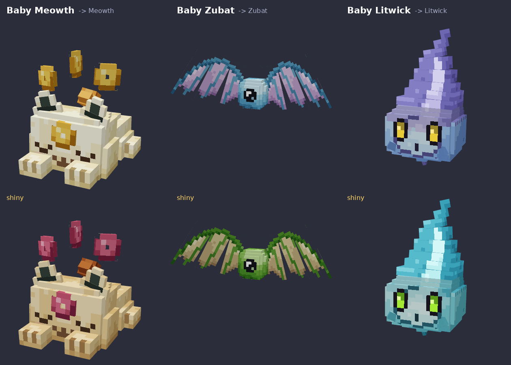
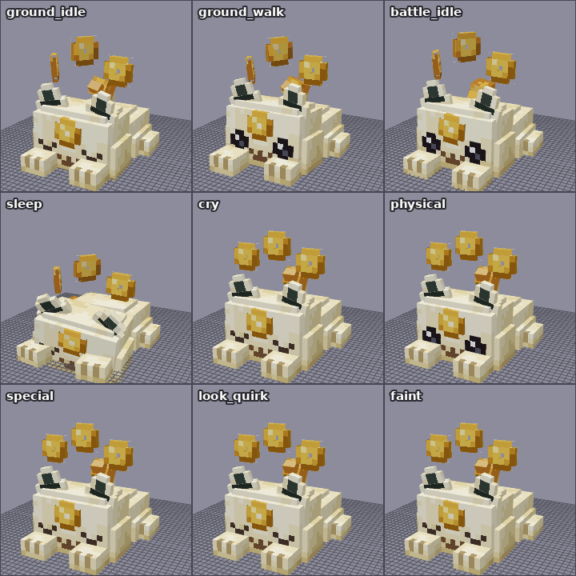
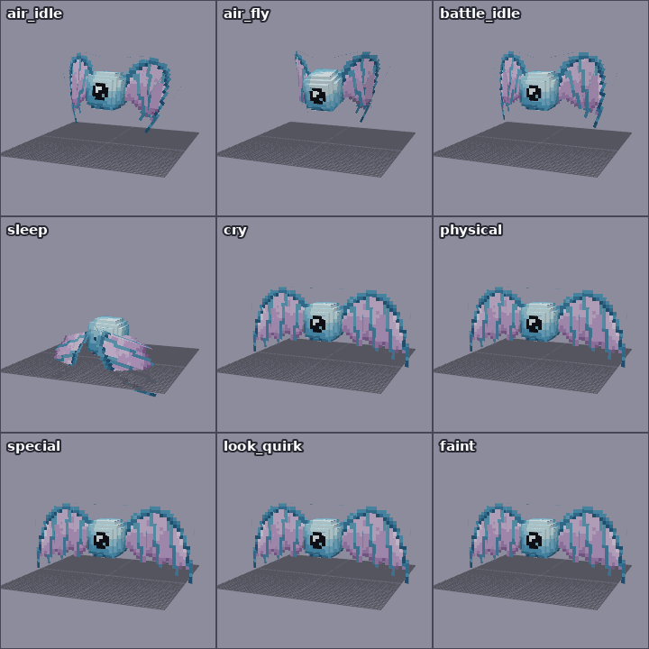
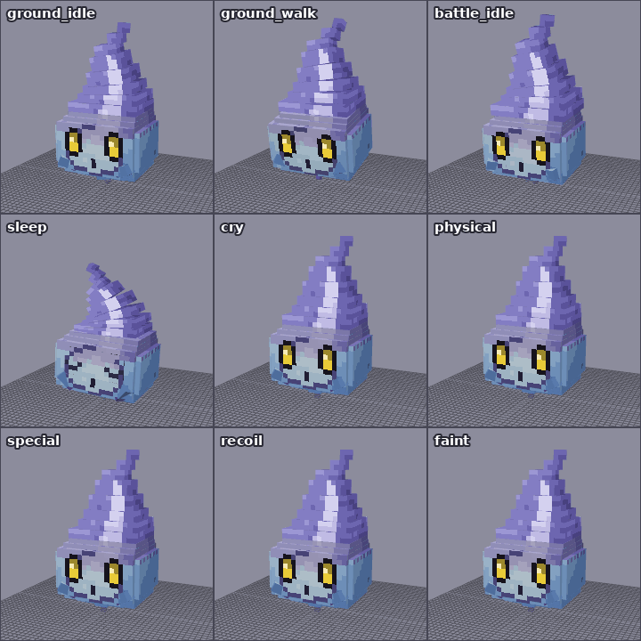

# cobblemon-windwave
Cobblemon 1.8.1 Wind Wave Project

## 아기 포켓몬 3종 — 아기나옹 · 아기주뱃 · 아기불켜미

나옹, 주뱃, 불켜미의 **전 진화(아기) 포켓몬** 3종을 Blockbench 모델, 텍스처, 애니메이션부터 Cobblemon 게임 데이터까지 구현했습니다.



| | 아기나옹 `babymeowth` | 아기주뱃 `babyzubat` | 아기불켜미 `babylitwick` |
|---|---|---|---|
| 원화 특징 | 식빵 자세의 크림색 아기 고양이, 이마의 구멍 뚫린 금화, 머리 위에 떠 있는 금화 3개, 끝이 주황색인 말린 꼬리, 만족스럽게 감은 눈 | 하늘색 눈알 몸통, 큰 검은 동공과 하이라이트, 거대한 연보라 박쥐 날개 | 파랑에서 보라로 변하는 불꽃 물방울 유령, 노란 눈, 작은 "o" 입, 뭉툭한 팔, 휘어 올라가는 불꽃 |
| 진화 | → 나옹 | → 주뱃 | → 불켜미 |
| 진화 조건 | 친밀도 160 이상에서 레벨업 (피츄·삐 같은 베이비 포켓몬 방식) | 동일 | 동일 |
| 타입 | 노말 | 독 / 비행 | 고스트 / 불꽃 |
| 텍스처 | 기본, 이로치(황갈색 털 + 장밋빛 금화), 알파 눈 | 기본, 이로치(초록 몸 + 황갈색 날개막, 이로치 주뱃과 동일 계열), 알파 눈 | 기본, 이로치(청록 불꽃 + 연두 눈, 이로치 불켜미와 동일 계열), **발광(불꽃·눈)**, 알파 눈 |
| 모델 | 29 큐브 / 39 본 / 128×64 | 12 큐브 / 21 본 / 128×64 | 22 큐브 / 31 본 / 128×128 |
| 애니메이션 | 11종 | 15종 | 12종 |

### 애니메이션 미리보기

| 아기나옹 | 아기주뱃 | 아기불켜미 |
|---|---|---|
|  |  |  |

| 포켓몬 | 애니메이션 (`animation.<id>.<이름>`) |
|---|---|
| 아기나옹 | `ground_idle`(숨쉬기, 귀 까딱, 꼬리 흔들기, 꾹꾹이, 금화 회전·부유) · `ground_walk`(뒤뚱 걸음, 눈 뜸) · `battle_idle`(경계 자세, 금화가 머리 위를 돎) · `sleep`(웅크리고 꼬리로 몸 감싸기, 금화가 낮게 떠다님) · `blink` · `look_quirk`(눈을 뜨고 두리번거리다 다시 감음) · `cry`(고개를 들고 "냐~", 금화 점프) · `physical`(웅크렸다 덮치며 앞발 할퀴기) · `special`(금화가 소용돌이치며 회전, 페이데이 느낌) · `recoil` · `faint`(납작 엎드리고 금화가 바닥에 떨어짐) |
| 아기주뱃 | `air_idle` · `ground_idle`(낮게 호버링) · `air_fly` · `ground_walk` · `battle_idle`(노려보기) · `sleep`(날개로 몸을 감싸 안고 눈 감기) · `blink`(눈꺼풀) · `look_quirk`(동공이 좌우위로 움직임) · `cry`(날개를 치켜들고 동공 수축) · `physical`(날개를 접고 급강하 박치기) · `special`(날개를 펼치고 최면 응시, 동공 맥동) · `recoil` · `faint`(날개를 펼친 채 바닥에 철퍼덕) · `shoulder_left` / `shoulder_right`(날개 접기) |
| 아기불켜미 | `ground_idle`(둥실둥실 떠다니며 불꽃이 층층이 일렁임) · `ground_walk`(앞으로 기울고 불꽃이 뒤로 날림) · `battle_idle`(불꽃이 커지고 팔을 듦) · `sleep`(바닥에 내려앉고 불꽃이 작아짐, 눈 감음) · `blink` · `cry`(^^ 웃는 눈 + 벌린 입, 불꽃이 확 타오름) · `physical`(몸통 박치기) · `special`(불꽃 폭발) · `recoil` · `faint`(불꽃이 사그라들며 바닥에 내려앉음) · `shoulder_left` / `shoulder_right` |

울음 애니메이션은 진화체의 울음소리(`pokemon.meowth.cry` 등)를 재생하고, 아기주뱃의 비행 애니메이션에는 주뱃과 같은 날갯짓 효과음 타임라인이 들어 있습니다.

## 폴더 구조

```
blockbench/                         ← Blockbench에서 바로 여는 원본 (.bbmodel, 텍스처·애니메이션 내장)
  babymeowth.bbmodel  babyzubat.bbmodel  babylitwick.bbmodel
assets/cobblemon/
  bedrock/pokemon/models/<도감번호_id>/<id>.geo.json
  bedrock/pokemon/animations/<도감번호_id>/<id>.animation.json
  bedrock/pokemon/posers/<도감번호_id>/<id>.json          ← 포즈 (대기/걷기/배틀/수면/어깨) + 초상화·프로필 위치
  bedrock/pokemon/resolvers/<도감번호_id>/0_<id>_base.json ← 기본/이로치/발광/알파 텍스처 연결
  textures/pokemon/<도감번호_id>/*.png
  lang/ko_kr.json  lang/en_us.json
data/cobblemon/
  species/custom/<id>.json                 ← 종족 데이터 (종족값, 특성, 기술, 진화, 행동)
  species_additions/<진화체>_<id>.json     ← 나옹/주뱃/불켜미에 preEvolution 지정
  spawn_pool_world/<도감번호_id>.json      ← 야생 출현
  dex_entries/pokemon/custom/<id>.json, dexes/windwave.json, dex_additions/windwave_national.json ← 도감 등록
pack.mcmeta  pack.png
docs/previews/                      ← 미리보기 이미지·GIF
tools/babygen/                      ← 모델·텍스처·애니메이션·데이터를 다시 생성하는 도구
```

## 설치 (Cobblemon 1.8.1 / Minecraft 1.21.1)

1. `pack.mcmeta`, `pack.png`, `assets/`, `data/` 를 하나의 zip으로 묶습니다 (`blockbench/`, `docs/`, `tools/` 는 게임에 필요 없습니다).
2. 그 zip을 월드의 `datapacks` 폴더와 `.minecraft/resourcepacks` 폴더 **양쪽에** 넣고 리소스팩을 켭니다. 데이터·리소스 겸용 팩입니다. Global Packs 같은 모드를 써도 됩니다.
3. 게임 안에서 `/pokespawn babymeowth`, `/pokespawn babyzubat`, `/pokespawn babylitwick` 으로 확인합니다.

## Blockbench에서 수정하기

- `blockbench/*.bbmodel` 을 Blockbench 5.x로 열면 됩니다. 형식은 Bedrock Entity, Box UV이고, Cobblemon 공식 모델과 같은 방식입니다. 텍스처(기본, 이로치, 발광, 알파)와 모든 애니메이션이 파일 안에 들어 있습니다.
- 본 이름은 Cobblemon 규칙을 따릅니다: 루트 본 = 포켓몬 id, `body`, `head`(아기나옹), `locator_*`(root, top, middle, target, face, mouth, hand_primary, special 등).
- 표정은 Cobblemon 공식 모델처럼 **숨겨 둔 판을 앞으로 밀어내는 방식**입니다. 아기나옹의 `eyes`(뜬 눈)와 `mouth`(벌린 입), 아기불켜미의 `eyes_closed`·`eyes_happy`·`mouth` 는 얼굴 표면 바로 안쪽에 숨어 있다가 애니메이션에서 z 방향으로 0.3~0.45 이동하면 보입니다. 아기주뱃은 `eyelid`(눈꺼풀)가 같은 방식이고, `pupil`(동공)은 위치 이동과 크기 조절로 시선과 감정을 표현합니다.
- 수정 후 내보내기:
  - 파일 → 내보내기 → Bedrock Geometry → `assets/cobblemon/bedrock/pokemon/models/<폴더>/<id>.geo.json`
  - 애니메이션 탭 → 모든 애니메이션 저장 → `assets/cobblemon/bedrock/pokemon/animations/<폴더>/<id>.animation.json`
  - 각 텍스처 → 다른 이름으로 저장 → `assets/cobblemon/textures/pokemon/<폴더>/`

## 게임 데이터 기본값 (자유롭게 수정하세요)

| | 아기나옹 | 아기주뱃 | 아기불켜미 |
|---|---|---|---|
| 도감번호(임시) | 2001 | 2002 | 2003 |
| 종족값 HP/공/방/특공/특방/스피드 | 30/30/25/30/30/65 (210) | 30/35/25/25/30/60 (205) | 35/20/40/50/40/15 (200) |
| 특성 | 픽업, 테크니션, (숨)긴장감 | 정신력, (숨)틈새포착 | 타오르는불꽃, 불꽃몸, (숨)틈새포착 |
| 레벨업 기술 | 할퀴기, 울음소리, 속이기, 고양이돈받기, 애교부리기, 탐내기, 물기 | 흡수, 초음파, 놀래키기, 검은눈빛, 흡혈, 이상한빛, 날개치기 | 놀래키기, 스모그, 불꽃세례, 작아지기, 이상한빛, 병상첨병, 불꽃튀기기 |
| 알·기술머신·가르침 기술 | 나옹과 동일 | 주뱃과 동일 | 불켜미와 동일 |
| 크기 (baseScale) | 0.36 | 0.36 | 0.28 (불켜미보다 작음) |
| 야생 출현 | 오버월드 초원 등(비 안 올 때), 마을 | 어두운 곳, 동굴, 밤의 숲·늪 | 저택(밤), 네더 영혼 불 바이옴, 으스스한 바이옴(밤) |
| 기타 | 어깨 탑승, 크리퍼가 피함 | 어깨 탑승, 걷지 않고 항상 비행 | 어깨 탑승, 불 면역, 빛을 냄 (lightLevel 8) |

알 그룹은 베이비 포켓몬 규칙대로 "알미발견"입니다. 영어 이름은 `Baby Meowth / Baby Zubat / Baby Litwick` 입니다. 나옹의 공식 한국어 이름에 맞춰 아기 포켓몬은 "아기나옹"으로 했습니다.

## 검증한 것

- **렌더링 확인**: Blockbench와 똑같은 방식(큐브 형상, Box UV, 본 회전 순서, 키프레임·Molang 보간)으로 그리는 3D 뷰어를 만들어, 모든 모델을 여러 각도에서, 모든 애니메이션을 프레임 단위로 렌더링해 확인했습니다. 결과물이 `docs/previews` 입니다. 이 뷰어로 Cobblemon 공식 나옹·주뱃·불켜미를 렌더링해 뷰어 자체가 정확한지도 확인했습니다.
- **내보내기 변환**: `.bbmodel` 에서 `.geo.json` / `.animation.json` 으로 바꾸는 규칙(x축 반전, 회전 부호)은 Blockbench 소스 코드의 Bedrock 코덱을 그대로 따랐습니다. 공식 불켜미의 `.geo.json` 과 `.animation.json` 을 같은 규칙으로 다시 읽어 원본 `.bbmodel` 과 같은 포즈가 나오는 것을 확인했습니다. 세 아기 포켓몬도 내보낸 파일을 다시 읽어 렌더링한 결과가 `.bbmodel` 과 **픽셀 단위로 일치**합니다 (`tools/babygen` 의 `npm run verify`).
- **Cobblemon 1.8.1 형식**: 포저, 리졸버, 종족, 스폰(`spawnablePositionType`), 도감, species_additions 형식은 Cobblemon 1.8.1 태그의 실제 소스와 데이터 파일을 보고 맞췄습니다. 애니메이션에 쓴 Molang 함수(`math.sin/pow/max/round/abs`)가 Cobblemon Molang 런타임에 있는 것도 확인했습니다.
- **초상화·프로필·어깨 위치**: Cobblemon GUI 코드(`drawPosablePortrait`, `drawProfilePokemon`)와 어깨 렌더러의 계산식을 그대로 옮겨 계산했습니다. 초상화 계산식은 공식 포켓몬(불켜미, 피츄, 주뱃, 나옹마, 가디)으로 맞춰 본 뒤 적용했습니다. 어깨 위치는 피츄와 같은 월드 좌표 오프셋이 되도록 맞췄습니다.

## 확인하지 못한 것 / 참고

- 이 작업 환경에는 **Blockbench MCP 서버가 연결되어 있지 않았습니다.** 그래서 Blockbench 프로젝트 형식(`.bbmodel`, format 5.0)을 직접 생성하고 위의 방법으로 검증했습니다. Blockbench에서 바로 열어 편집할 수 있는 형식입니다.
- 실제 마인크래프트 클라이언트에서는 테스트하지 못했습니다. 게임에서 보면 초상화 확대 비율이나 어깨 위치를 조금 조정하고 싶을 수 있습니다. 조정은 `assets/cobblemon/bedrock/pokemon/posers/…` 의 `portraitScale/portraitTranslation`, `profileScale/profileTranslation`, `transformedParts` 값으로 합니다.
- 종족값, 기술, 출현 확률, 도감번호, 이름은 제안값입니다. 정해 둔 이름이나 설정이 있으면 알려 주세요. `tools/babygen/pokemon.js` 한 곳만 바꾸면 전체를 다시 생성할 수 있습니다.

## 재생성 도구 (`tools/babygen`)

모델, 텍스처, 애니메이션, 게임 데이터는 모두 `tools/babygen` 의 스크립트로 만들어졌습니다. 원화 색을 3D 위치에 맞춰 칠하는 텍스처 페인터, Box UV 자동 배치, Blockbench/Bedrock 내보내기, 미리보기 렌더러가 들어 있습니다.

```bash
cd tools/babygen
npm install                  # three, pngjs (+ 미리보기용 playwright)
npm run export               # 모델 빌드 → blockbench/, assets/, data/, pack.mcmeta 다시 쓰기
npm run verify               # 내보낸 geo/animation 과 .bbmodel 픽셀 비교
npm run previews             # docs/previews GIF·이미지, pack.png 다시 만들기 (python3 + Pillow 필요)
```

Blockbench에서 직접 수정하기 시작했다면 그때부터는 `.bbmodel` 이 원본입니다. `npm run export` 를 다시 실행하면 수정한 파일을 덮어쓰니 주의하세요.
