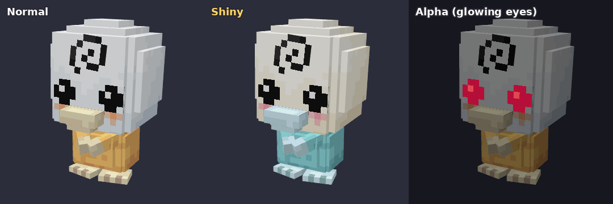
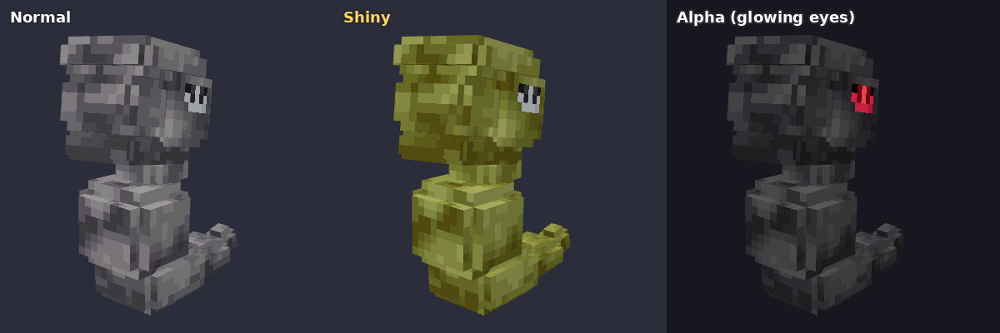

# cobblemon-windwave
Cobblemon 1.8.1 Wind Wave Project

## 아기고라파덕 `babypsyduck` (모델링)

고라파덕의 아기 버전 Blockbench 모델입니다. 고라파덕 텍스처 색으로 칠한 기본·이로치·알파 텍스처와 애니메이션 13종, Cobblemon 포저·리졸버가 들어 있습니다.

- Blockbench 원본: `blockbench/babypsyduck.bbmodel`
- 게임 파일: `assets/cobblemon/...` (리소스팩: `pack.mcmeta` + `assets/` 를 zip으로 묶어 넣기)
- 자세한 설명, 애니메이션 미리보기, 게임에 넣는 방법: [docs/babypsyduck/README.md](docs/babypsyduck/README.md)

## 스월덕 `swirlduck` (가칭, 고라파덕의 또 다른 진화 · 모델링)

원화에서 골덕 옆에 있는 진화형입니다. 가시 달린 흰 투구와 파란 소용돌이, 빛나는 금색 보석, 깃털 망토가 특징입니다. 고라파덕 텍스처 색으로 칠한 기본·이로치·알파 텍스처와 보석 발광 레이어, 애니메이션 14종, Cobblemon 포저·리졸버가 들어 있습니다.

- Blockbench 원본: `blockbench/swirlduck.bbmodel`
- 자세한 설명, 애니메이션 미리보기, 게임에 넣는 방법, 이름 바꾸는 방법: [docs/swirlduck/README.md](docs/swirlduck/README.md)

## 아기롱스톤 `babyonix` (모델링)

롱스톤의 아기 버전입니다. 공식 롱스톤 텍스처의 바위 무늬를 그대로 옮겨 칠한 기본·이로치(올리브색)·알파 텍스처와 애니메이션 12종, Cobblemon 포저·리졸버가 들어 있습니다.

- Blockbench 원본: `blockbench/babyonix.bbmodel`
- 자세한 설명, 텍스처를 옮긴 방법, 애니메이션 미리보기, 게임에 넣는 방법: [docs/babyonix/README.md](docs/babyonix/README.md)

