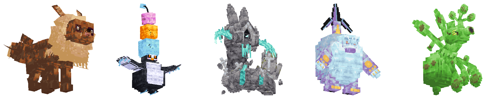
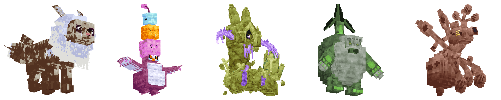

# Cobblemon Windwave

**Cobblemon 1.8.1 (Minecraft 1.21.1)**용 신규 포켓몬 애드온입니다.
기존 포켓몬의 새로운 진화형 5마리를 리소스팩 + 데이터팩으로 추가합니다.




## 다운로드

| 파일 | 넣는 위치 |
| --- | --- |
| [`dist/Windwave-ResourcePack-1.0.0-cobblemon-1.8.1.zip`](dist/Windwave-ResourcePack-1.0.0-cobblemon-1.8.1.zip) | `.minecraft/resourcepacks/` → 게임에서 리소스팩 활성화 |
| [`dist/Windwave-DataPack-1.0.0-cobblemon-1.8.1.zip`](dist/Windwave-DataPack-1.0.0-cobblemon-1.8.1.zip) | 월드 폴더의 `datapacks/` (월드 생성 화면의 "데이터 팩" 버튼으로 넣어도 됨) |

- **두 팩을 모두** 넣어야 합니다. 데이터팩만 있으면 모델이 보이지 않고, 리소스팩만 있으면 포켓몬이 존재하지 않습니다.
- 서버라면 데이터팩은 서버 월드에, 리소스팩은 접속하는 모든 클라이언트에 넣어 주세요.
- 필요 모드: Cobblemon 1.8.1 (Fabric 또는 NeoForge) — 그 외 추가 모드 없음.

## 추가 포켓몬

| No. | 이름 | 타입 | 원래 포켓몬 | 특성 (숨겨진 특성) | 종족값 (H/A/B/C/D/S, 합) | 전용기 |
| --- | --- | --- | --- | --- | --- | --- |
| 1079 | **이브이온** Eeveeon | 노말 | 이브이 | 적응력 / 배짱 (하늘의은총) | 95/75/70/110/100/75 = 525 | 라스트에볼루션 |
| 1080 | **트리큐보** Threiscue | 얼음/물 | 빙큐보 | 아이스바디 / 쓱쓱 (눈치우기) | 95/80/115/110/100/50 = 550 | 트리플프리즈빔 |
| 1081 | **크립토닉스** Cryptonix | 바위/고스트 | 롱스톤 | 저주받은바디 / 옹골참 (돌머리) | 85/110/165/55/90/30 = 535 | 무덤봉기 |
| 1082 | **아발롯** Avalott | 강철/얼음 | 꽁어름 | 예리함 / 아이스바디 (옹골참) | 75/125/140/45/70/65 = 520 | 서리톱날 |
| 1083 | **클리위드** Cleaweed | 물/드래곤 | 수레기 | **정화**(신규) / 적응력 (재생력) | 80/70/95/107/113/45 = 510 | 정화그물 |

## 진화 방법 (포켓몬마다 3가지)

기존 진화(부스터·강철톤·크레베이스·드래캄 등)는 그대로 유지되고, 아래 진화가 **추가**됩니다.
조건이 동시에 맞으면 Cobblemon 진화 화면에서 원하는 진화를 고를 수 있습니다.

### 이브이 → 이브이온
1. **노말주얼**을 이브이에게 사용
2. **실크스카프**를 지닌 채 친밀도 200 이상에서 레벨업 (스카프 소모)
3. **비장의무기(Last Resort)**를 배운 상태로 Lv.30 이상에서 레벨업 → 진화 시 노말주얼 획득

### 빙큐보 → 트리큐보
1. **얼음의돌** 사용
2. Lv.45 이상, **추운 바이옴에서 눈/비가 올 때** 레벨업
3. **녹지않는얼음**을 지닌 채 Lv.40 이상에서 레벨업 (아이템 소모)

### 롱스톤 → 크립토닉스
1. **영계의천**을 지닌 채 **통신교환** (강철톤의 금속코트 진화와 같은 방식)
2. **밤에** 영계의천을 롱스톤에게 사용 (혼자서도 가능)
3. Lv.40 이상, **고대 도시(Ancient City) 안이나 딥 다크** 바이옴에서 레벨업 → 진화 시 영혼 모래 획득

### 꽁어름 → 아발롯
1. **드니차(Frigibax)와 통신교환** (딱정곤↔쪼마리 방식)
2. 파티에 **드니차**가 있을 때 **연결의끈(Link Cable)** 사용 (혼자서도 가능)
3. Lv.30 이상, 추운 바이옴에서 **금속코트** 사용
- 어느 방법이든 진화하면 얼음을 벗어 던져 **파란 얼음**을 떨어뜨립니다.

### 수레기 → 클리위드
1. **바다·강·늪·해안** 바이옴에서 **리프의돌** 사용
2. **독 타입 포켓몬을 10마리 쓰러뜨린 뒤** Lv.30 이상에서 레벨업 ("청소할수록 초록색")
3. **물의파동**을 20번 사용한 뒤 레벨업

## 전용기

모두 Cobblemon 1.8.1에 내장된 Showdown 엔진에서 실제 배틀로 동작을 검증했습니다 (`tools/test/showdown_test.js`).
각 기술은 모델에 들어 있는 전용 애니메이션 + 파티클/사운드 연출(action effect)로 재생됩니다.

| 기술 | 타입 / 분류 | 위력 | 명중 | PP | 효과 |
| --- | --- | --- | --- | --- | --- |
| 라스트에볼루션 Last Evolution | 노말 / 특수 | 80+ | 100 | 5 | 파티에 있는 **서로 다른 이브이·이브이 진화형 1마리당 위력 +20** (최대 200) |
| 트리플프리즈빔 Triple Freeze Beam | 얼음 / 특수 | 35×3 | 90 | 10 | 머리 위 얼음 큐브 3개에서 광선 — **3회 연속 공격**, 매 타 10% 얼음 |
| 무덤봉기 Grave Uprising | 고스트 / 물리 | 90 | 100 | 10 | 땅에서 묘비와 망령의 손이 솟아올라 **상대를 붙잡아 교체·도망 불가** |
| 서리톱날 Frostsaw | 얼음 / 물리 | 80 | 100 | 10 | 팽이처럼 회전하는 베기 — **급소율↑**, 10% 얼음, **자기 진영의 설치기·조이기 제거** (예리함 적용) |
| 정화그물 Cleansing Net | 물 / 특수 | 80 | 100 | 10 | **상대의 능력 변화 초기화** + **자신의 상태 이상 회복** |

신규 특성 **정화 (Purify)** — 독 타입 기술이 물 타입이 되고 위력 1.2배, 독 상태가 되지 않음.

전용기는 레벨업(Lv.1)·진화 시 습득하며, **TM 머신**에서도 만들 수 있습니다 (해당 포켓몬 전용).

| TM | 재료 |
| --- | --- |
| 라스트에볼루션 | 노말주얼 ×3, 진화의휘석 ×1 |
| 트리플프리즈빔 | 얼음주얼 ×3, 녹지않는얼음 ×1 |
| 무덤봉기 | 고스트주얼 ×3, 저주의부적 ×1 |
| 서리톱날 | 얼음주얼 ×2, 강철주얼 ×2 |
| 정화그물 | 물주얼 ×3, 기적의씨 ×1 |

## 들어간 1.7 ~ 1.8 신기능

- **알파 포켓몬** — 5마리 모두 알파 무리(herd) 스폰, 알파 전용 빨간 눈 발광 텍스처(`_alpha.png`) + 눈 로케이터, 알파는 주얼을 지니고 등장
- **TM 시스템** — 전용기 TM 레시피 5종, 모든 종에 `tm:` 습득 목록(TM 머신·무브 도감 호환)
- **라이딩** — 이브이온(지상), 크립토닉스(지상, **알파일 때만 열리는 2번 좌석** = 1.8 조건부 좌석), 클리위드(지상 + 수상 돌고래형, 물 소리)
- **서식지 블록(Habitat Block) 풀** — `윈드웨이브 성역` 풀: 날마다(페이즈) 다른 진화 계열이 등장, 6페이즈는 알파 이브이온
- **진화 드롭** — 진화할 때 아이템을 떨어뜨림 (노말주얼 / 영혼 모래 / 파란 얼음)
- **새 진화 조건** — 통신교환 상대 지정, 파티 멤버, 구조물, 날씨, 바이옴, 기술 사용 횟수, 특정 타입 처치 수, `any` 조합
- **도감** — 새 지역 도감 `윈드웨이브`(전국도감에 포함), 도감 설명 한/영
- **스폰** — 일반·물 위·물속·**낚시(미끼 레벨 보너스)**·포케스낵 보너스·고대 도시 프리셋
- **기술 연출(Action Effect)** — 전용 애니메이션 + 새 파티클 8종 + 기존 이펙트/사운드 조합
- **커스텀 Showdown 기술·특성** — 데이터팩 `moves/*.js`, `abilities/*.js`
- **AI 행동** — 클리위드는 쓰레기·독 포켓몬(깨봉이/더스트나/질퍽이/질뻐기)을 적대, 아발롯은 근접 공격 행동
- **발광(dynamic lights)** — 트리큐보(머리 위 낚싯대 불빛), 크립토닉스(망령의 불꽃)
- **울음소리** — 요약 화면에서 클릭 시 재생되는 고유 울음소리(원종 울음을 피치 변경)
- 개체 크기 랜덤(±5%), 아기 크기 등 1.8 크기 시스템은 자동 적용

## 폴더 구조

```
source/bbmodel/          원본 Blockbench 모델 (애니메이션·텍스처 포함)
resourcepack/            리소스팩 (모델, 애니메이션, 포저, 리졸버, 텍스처, 파티클, 언어, 사운드)
datapack/                데이터팩 (종, 진화, 전용기 JS, 특성 JS, 스폰, 도감, TM, 기술 연출, 서식지)
dist/                    다운로드용 zip
tools/                   변환·빌드·검증 스크립트
docs/images/             미리보기 이미지
```

## 다시 빌드하기

```bash
pip install numpy pillow
python3 tools/build_packs.py          # bbmodel → 리소스팩/데이터팩 생성 + dist/*.zip
```

- `tools/convert_bbmodel.py` — Blockbench의 Bedrock 내보내기 로직(좌표·회전 반전, 키프레임 형식)을 그대로 옮긴 변환기
- `tools/windwave_species.py` — 종족값·특성·진화·기술표·도감 문구 등 모든 기획 데이터
- `tools/validate.py <cobblemon 소스> <showdown 폴더>` — 팩이 참조하는 기술/아이템/바이옴 태그/파티클/사운드/애니메이션이 1.8.1에 실제로 있는지 검사
- `tools/test/showdown_test.js` — Cobblemon 1.8.1의 Showdown으로 전용기·특성 배틀 테스트

## 참고

- 도감 번호 1079–1083은 공식 포켓몬과 겹치지 않는 번호입니다.
- 초상화(파티 아이콘)·요약 화면 프레이밍 값은 모델 크기로 계산한 값이라, 게임 안에서 어색하면 포저 파일의 `portraitScale/portraitTranslation`, `profileScale/profileTranslation`을 조정하면 됩니다.
- 아발롯·클리위드의 알파 눈 로케이터는 원본 모델에서 꽁어름·수레기 크기 위치에 남아 있어서, 실제 눈 위치로 옮겨서 내보냈습니다.

---

### English summary

Windwave adds five new evolutions for Cobblemon 1.8.1: **Eeveeon** (Normal, from Eevee), **Threiscue** (Ice/Water, from Eiscue),
**Cryptonix** (Rock/Ghost, from Onix), **Avalott** (Steel/Ice, from Bergmite) and **Cleaweed** (Water/Dragon, from Skrelp).
Each has three evolution methods, a custom signature move with its own animation and action effect, alpha herds, TM recipes,
spawns, Pokédex entries, and (for three of them) riding. Install the resource pack on clients and the data pack in the world.
