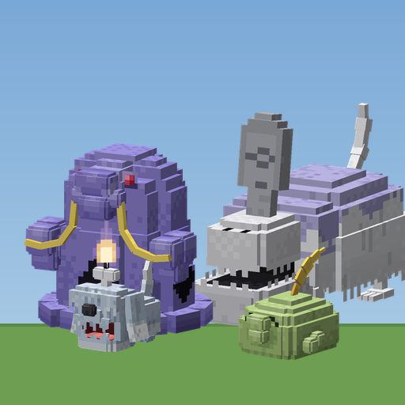
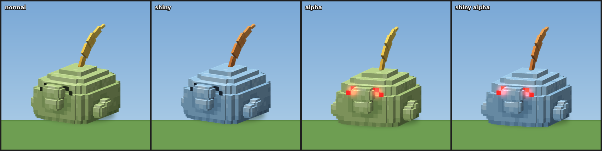
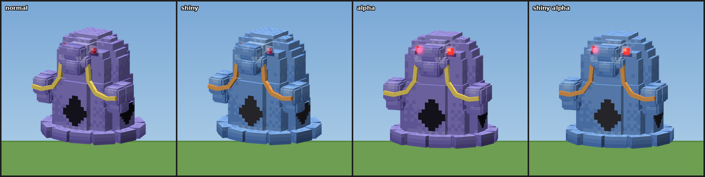

# cobblemon-windwave
Cobblemon 1.8.1 Wind Wave Project

Cobblemon 1.8.1(Minecraft 1.21.1)에 아직 모델이 없는 포켓몬을 추가하는 리소스팩 + 데이터팩입니다.



## 추가된 포켓몬

| No. | 포켓몬 | 일반 | 이로치 | 알파 | 성별 차이 |
|---|---|---|---|---|---|
| #316 | 꼴깍몬 (Gulpin) | ✔ | ✔ 하늘색 몸 + 주황 깃털 | ✔ 붉게 빛나는 눈 | 암컷은 머리 깃털이 짧음 |
| #317 | 꿀꺽몬 (Swalot) | ✔ | ✔ 파란 몸 + 주황 수염 | ✔ 붉게 빛나는 눈 | 암컷은 수염이 짧음 |

- 이로치 색상은 공식 Pokémon HOME 3D 렌더의 색을 추출해서 적용했습니다.
- 알파는 Cobblemon 1.8의 방식 그대로 `alpha_eyes` aspect + 발광(emissive) 눈 레이어를 쓰고,
  모델에 `eye1`/`eye2` 로케이터가 있어서 Cobblemon 기본 알파 눈 잔상/블룸 효과가 그대로 나옵니다.
  알파 크기 확대는 Cobblemon 본체가 처리합니다.




### 애니메이션

공식 게임/애니메이션에서의 모습(슬라임처럼 통통 튀며 이동, 입술을 오므렸다가 크게 벌려 삼키기,
하품을 배우는 꼴깍몬, 젤리처럼 출렁이는 꿀꺽몬 등)을 참고해서 만들었습니다.

| 애니메이션 | 꼴깍몬 | 꿀꺽몬 | 설명 |
|---|---|---|---|
| `ground_idle` | ✔ | ✔ | 숨쉬듯 부풀었다 줄어듦, 깃털/수염이 늦게 따라 흔들림 |
| `ground_walk` | ✔ | ✔ | 통통 튀는 슬라임 이동 (착지 시 찌그러짐) |
| `battle_idle` | ✔ | ✔ | 팔을 들고 들썩이는 전투 대기 |
| `sleep` | ✔ | ✔ | 녹아내리듯 퍼져서 느리게 숨쉬기 |
| `cry` | ✔ | ✔ | 입술을 크게 벌리며 울음 |
| `physical` | ✔ | ✔ | 몸통박치기(점프 후 덮치기) |
| `special` / `spray` | ✔ | ✔ | 부풀었다가 오물/독액을 뱉음 (오물폭탄, 애시드봄 등) |
| `status` | ✔ | ✔ | 좌우로 흔들흔들 |
| `recoil` | ✔ | ✔ | 피격 시 출렁임 |
| `faint` | ✔ | ✔ | 납작하게 녹아내림 |
| `blink` (quirk) | ✔ | ✔ | 눈 깜빡임 |
| `gulp` (quirk) | ✔ | ✔ | 가끔 꿀꺽 삼키는 동작 (몸을 타고 내려가는 출렁임) |
| `yawn` (quirk) | ✔ | | 가끔 크게 하품 (하품 기술을 배우는 꼴깍몬) |

각 애니메이션 GIF는 `previews/gulpin/`, `previews/swalot/` 폴더에 있습니다.

### 스폰 (데이터팩)

- `species_additions`로 두 포켓몬을 `implemented: true`로 켜고 크기/히트박스를 지정합니다.
- 꼴깍몬: 늪/초원(흔함), 평원/사바나, 마을 주변, 도시(콘크리트 주변) — Lv. 8-28
- 꿀꺽몬: 늪/사바나(드묾), 초원/평원(희귀), 도시 — Lv. 26-48
- 무리: 꼴깍몬 무리(가끔 꿀꺽몬 동행)
- 알파 무리(boss): 알파 꿀꺽몬이 꼴깍몬/꿀꺽몬을 이끄는 무리, 알파 꼴깍몬 무리

## 설치

1. `dist/cobblemon-windwave-gulpin-swalot.zip`을 받습니다.
2. 리소스팩: `.minecraft/resourcepacks/`에 넣고 게임에서 활성화합니다.
3. 데이터팩: 같은 zip을 월드의 `datapacks/` 폴더(`saves/<월드>/datapacks/`)에 넣고 `/reload` 하거나 월드를 다시 엽니다.
   (서버라면 서버 월드의 `datapacks/` 폴더, 클라이언트에는 리소스팩)

테스트 명령어:

```
/pokespawn gulpin
/pokespawn gulpin shiny
/pokespawn gulpin alpha=true
/pokespawn swalot gender=female
/pokespawn swalot shiny alpha=true
```

## 폴더 구조

```
pack/                                   리소스팩 + 데이터팩 원본 (zip 내용)
  assets/cobblemon/bedrock/pokemon/
    models/0316_gulpin/gulpin.geo.json   Blockbench에서 열어서 수정 가능 (Bedrock Entity)
    animations/…/gulpin.animation.json
    posers/…/gulpin.json, gulpin_female.json
    resolvers/…/0_gulpin_base.json
  assets/cobblemon/textures/pokemon/0316_gulpin/gulpin.png, gulpin_shiny.png, gulpin_alpha.png
  data/cobblemon/species_additions/, spawn_pool_world/
tools/                                  모델/텍스처/애니메이션 생성 스크립트 (Python)
previews/                               미리보기 이미지와 애니메이션 GIF
dist/                                   배포용 zip
```

## 다시 빌드하기

```
pip install pillow numpy
python3 tools/build.py              # pack/ 다시 생성
python3 tools/build.py --previews   # 미리보기까지 렌더링 (몇 분 걸림)
python3 tools/validate.py           # 본/애니메이션/텍스처 참조 검사
python3 tools/make_zip.py           # dist/ zip 생성
```

`tools/cobblegen/`에는 Cobblemon의 Bedrock→Java 모델 변환 방식을 그대로 따라 한 미리보기 렌더러,
3D 위치 기반 텍스처 페인터, Molang 애니메이션 평가기가 들어 있어서 다른 포켓몬을 추가할 때도 재사용할 수 있습니다.

## 참고

- 초상화(파티/요약 화면) 위치값(`portraitScale`, `portraitTranslation` 등)은 비슷한 크기의 공식 모델 값을 기준으로 잡았습니다.
  게임에서 보고 조금 어긋나면 `posers/*.json` 상단의 값만 조정하면 됩니다.
- 포켓몬 이름/도감 설명은 Cobblemon 본체에 이미 있어서 따로 넣지 않았습니다.
