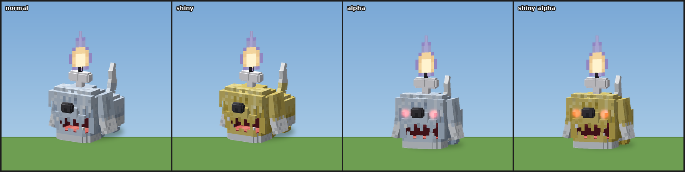
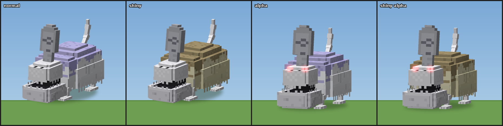

# cobblemon-windwave
Cobblemon 1.8.1 Wind Wave Project

Cobblemon 1.8.1(Minecraft 1.21.1)에 아직 모델이 없는 포켓몬(꼴깍몬·꿀꺽몬·망망이·묘두기)을 추가하는 리소스팩 + 데이터팩입니다.


## 추가된 포켓몬

| No. | 포켓몬 | 일반 | 이로치 | 알파 | 성별 차이 |
|---|---|---|---|---|---|
| #316 | 꼴깍몬 (Gulpin) | ✔ | ✔ 하늘색 몸 + 주황 깃털 | ✔ 붉게 빛나는 눈 | 암컷은 머리 깃털이 짧음 |
| #317 | 꿀꺽몬 (Swalot) | ✔ | ✔ 파란 몸 + 주황 수염 | ✔ 붉게 빛나는 눈 | 암컷은 수염이 짧음 |
| #971 | 망망이 (Greavard) | ✔ | ✔ 금색 털 | ✔ 앞머리 틈으로 붉은 눈 | 없음 |
| #972 | 묘두기 (Houndstone) | ✔ | ✔ 황갈색 털 + 갈색 등 | ✔ 해골 코 위로 붉은 눈 | 없음 |

- 이로치 색상은 공식 Pokémon HOME 3D 렌더의 색을 추출해서 적용했습니다.
- 알파는 Cobblemon 1.8의 방식 그대로 `alpha_eyes` aspect + 발광(emissive) 눈 레이어를 쓰고,
  모델에 `eye1`/`eye2` 로케이터가 있어서 Cobblemon 기본 알파 눈 잔상/블룸 효과가 그대로 나옵니다.
  알파 크기 확대는 Cobblemon 본체가 처리합니다.





### 꼴깍몬 · 꿀꺽몬 애니메이션

공식 게임/애니메이션에서의 모습(슬라임처럼 통통 튀며 이동, 입술을 오므렸다가 크게 벌려 삼키기,
하품을 배우는 꼴깍몬, 젤리처럼 출렁이는 꿀꺽몬 등)을 참고해서 만들었습니다.

| 애니메이션 | 꼴깍몬 | 꿀꺽몬 | 설명 |
|---|---|---|---|
| `ground_idle` | ✔ | ✔ | 숨쉬듯 부풀었다 줄어듦, 깃털/수염이 늦게 따라 흔들림 |
| `ground_walk` | ✔ | ✔ | 통통 튀는 슬라임 이동 (착지 시 찌그러짐) |
| `battle_idle` | ✔ | ✔ | 팔을 들고 들썩이는 전투 대기 |
| `sleep` | ✔ | ✔ | 녹아내리듯 퍼져서 느리게 숨쉬기 |
| `cry` | ✔ | ✔ | 입술을 크게 벌리며 울음 |
| `physical` | ✔ | ✔ | 몸통박치기(점프 후 덮치기) |
| `special` / `spray` | ✔ | ✔ | 부풀었다가 오물/독액을 뱉음 (오물폭탄, 애시드봄 등) |
| `status` | ✔ | ✔ | 좌우로 흔들흔들 |
| `recoil` | ✔ | ✔ | 피격 시 출렁임 |
| `faint` | ✔ | ✔ | 납작하게 녹아내림 |
| `blink` (quirk) | ✔ | ✔ | 눈 깜빡임 |
| `gulp` (quirk) | ✔ | ✔ | 가끔 꿀꺽 삼키는 동작 (몸을 타고 내려가는 출렁임) |
| `yawn` (quirk) | ✔ | | 가끔 크게 하품 (하품 기술을 배우는 꼴깍몬) |

각 애니메이션 GIF는 `previews/gulpin/`, `previews/swalot/` 폴더에 있습니다.

### 스폰 (데이터팩)

- `species_additions`로 네 포켓몬을 `implemented: true`로 켜고 크기/히트박스를 지정합니다.
- 꼴깍몬: 늪/초원(흔함), 평원/사바나, 마을 주변, 도시(콘크리트 주변) — Lv. 8-28
- 꿀꺽몬: 늪/사바나(드묾), 초원/평원(희귀), 도시 — Lv. 26-48
- 무리: 꼴깍몬 무리(가끔 꿀꺽몬 동행)
- 알파 무리(boss): 알파 꿀꺽몬이 꼴깍몬/꿀꺽몬을 이끄는 무리, 알파 꼴깍몬 무리
- 망망이: 으스스한 숲·평원·초원, 마을 주변 — Lv. 10-29, 밤에 더 자주
- 묘두기: 같은 곳에서 희귀 — Lv. 30-50, 밤에 더 자주
- 알파 무리(boss): 알파 망망이 무리, 알파 묘두기가 망망이/묘두기를 이끄는 무리 (지닌 물건: 저주의부적)

## 망망이 (Greavard, #971)

| 항목 | 내용 |
|---|---|
| 일반 | 푸른 회색 털, 흰 털끝, 뼈 위 촛불(보라 겉불꽃 + 노란 속불꽃) |
| 이로치 | 금색 털 (공식 HOME 렌더 색), 흰 털끝·뼈·불꽃은 그대로 |
| 알파 | 평소엔 앞머리에 가려 안 보이는 눈이, 알파일 때만 앞머리 틈으로 붉게 빛남 |
| 불꽃 | 4프레임 애니메이션 발광 텍스처(Cobblemon 애니메이션 레이어) + 흔들림 애니메이션 |

| 애니메이션 | 설명 |
|---|---|
| `ground_idle` | 혀를 내밀고 헥헥, 꼬리 흔들기, 불꽃 일렁임 |
| `ground_walk` | 대각선 다리로 총총 걷기, 귀·꼬리·불꽃이 늦게 따라옴 |
| `battle_idle` | 엎드려 장난치는 자세(플레이 바우)로 덤빌 준비 |
| `sleep` | 땅속에 숨어 촛불만 내놓고 기다림 (도감 설정) |
| `cry` | 땅에서 튀어나오며 유령 같은 울음 |
| `physical` | 달려들어 콱 깨물기 (뼈를 부수는 턱) |
| `special` / `spray` | 몸을 젖혔다가 불꽃이 크게 타오르며 휘둘림 |
| `status` | 꼬리흔들기(Tail Whip) — 엉덩이를 돌려 꼬리를 흔듦 |
| `recoil` / `faint` | 피격 / 납작 엎드리며 촛불이 꺼져감 |
| quirk `wag`, `shake`, `sniff` | 꼬리 흔들기, 젖은 개처럼 털기, 땅 냄새 맡기 |

## 묘두기 (Houndstone, #972)

| 항목 | 내용 |
|---|---|
| 일반 | 흰 털 + 연보라 등과 목털, 해골 머리와 바위 같은 큰 아래턱, 머리 위 묘비(물결 무늬 새김), 뼈 다리·발톱, 뼈 꼬리 |
| 이로치 | 황갈색 털 + 갈색 등 (공식 HOME 렌더 색), 뼈·묘비는 그대로 |
| 알파 | 눈이 보이지 않는 해골 머리에서, 알파일 때만 코 위로 붉은 눈이 빛남 |

| 애니메이션 | 설명 |
|---|---|
| `ground_idle` | 충직한 경비견처럼 차분히 숨쉬기, 턱·목털·꼬리 흔들림 |
| `ground_walk` | 뼈 다리로 묵직하게 걷기, 묘비·목털이 흔들림 |
| `battle_idle` | 머리를 낮추고 턱을 덜덜 떨며 으르렁 |
| `sleep` | 무덤처럼 털 더미로 납작 엎드리고 묘비만 서 있음 ("묘지에서 잠을 잔다" 도감 설정) |
| `cry` | 고개를 들고 턱을 크게 벌려 길게 울부짖기 |
| `physical` | 라스트리스펙트처럼 달려들어 큰 턱으로 깨물기 |
| `special` / `spray` | 앞발을 들고 일어섰다가 울부짖으며 내려찍기 |
| `status` | 몸을 돌려 꼬리 흔들기 |
| `recoil` / `faint` | 피격 / 털 더미로 주저앉고 묘비만 남음 |
| quirk `wag`, `look`, `shake` | 꼬리 흔들기, 좌우 경계, 털 털기 |

## 설치

`dist/` 폴더에 리소스팩과 데이터팩이 따로 있습니다.

| 파일 | 넣는 곳 |
|---|---|
| `cobblemon-windwave_resourcepack.zip` | `.minecraft/resourcepacks/` → 게임 설정에서 리소스팩 활성화 |
| `cobblemon-windwave_datapack.zip` | `saves/<월드>/datapacks/` → `/reload` 또는 월드 다시 열기 |
| `cobblemon-windwave.zip` | 리소스팩+데이터팩 합본 (두 곳에 같은 파일을 넣어도 됨) |
| `cobblemon-windwave-models.zip` | 모든 포켓몬의 모델/애니메이션/포저/리졸버/텍스처(일반·이로치·알파) 파일 모음 (팩 아님) |

네 포켓몬(꼴깍몬·꿀꺽몬·망망이·묘두기)이 모두 하나의 팩에 들어 있습니다. 예전 `cobblemon-windwave-gulpin-swalot*.zip`은 지우고 이걸로 바꾸면 됩니다.

서버라면 데이터팩은 서버 월드의 `datapacks/` 폴더에, 리소스팩은 각 클라이언트에 넣습니다.
두 팩 모두 있어야 합니다. 데이터팩만 있으면 모델 없이 스폰되고, 리소스팩만 있으면 스폰되지 않습니다.

테스트 명령어:

```
/pokespawn gulpin
/pokespawn gulpin shiny
/pokespawn gulpin alpha=true
/pokespawn swalot gender=female
/pokespawn swalot shiny alpha=true
/pokespawn greavard shiny
/pokespawn houndstone alpha=true
```

## Cobblemon jar에 직접 넣은 버전 (팩 없이)

리소스팩·데이터팩 대신, Cobblemon 1.8.1 jar 자체에 네 포켓몬을 넣은 버전도 만들 수 있습니다.
Cobblemon이 자기 포켓몬을 넣는 방식 그대로입니다.

- 모델·애니메이션·포저·리졸버·텍스처 → jar 안 `assets/cobblemon/...`
- 종 파일(`data/cobblemon/species/generation3/gulpin.json` 등 4개)에 `implemented: true`, 크기, 히트박스를 직접 기록
- 스폰·알파 무리 → jar 안 `data/cobblemon/spawn_pool_world/...`
- 그 외 Cobblemon 원본 파일은 하나도 바뀌지 않음

```
python3 tools/patch_jar.py Cobblemon-fabric-1.8.1+1.21.1.jar     # -> ...-windwave.jar
```

사용법: `mods` 폴더의 원래 Cobblemon jar를 빼고 이 jar로 바꾸면 됩니다. 이때 리소스팩·데이터팩은 넣지 않아도 됩니다.
멀티플레이라면 서버와 모든 플레이어가 같은 jar를 써야 합니다.

## Blockbench 모델링 파일 (.bbmodel)

`bbmodel/` 폴더에 포켓몬마다 Blockbench 프로젝트 파일이 있습니다 (Blockbench 4.10 이상 / 5.x에서 열기).

| 파일 | 들어있는 것 |
|---|---|
| `bbmodel/gulpin.bbmodel` | 모델(본·큐브·로케이터), 텍스처 3장(일반·이로치·알파), 애니메이션 14개 |
| `bbmodel/swalot.bbmodel` | 모델, 텍스처 3장(일반·이로치·알파), 애니메이션 13개 |
| `bbmodel/greavard.bbmodel` | 모델, 텍스처 7장(일반·이로치·알파·불꽃 4프레임), 애니메이션 14개 |
| `bbmodel/houndstone.bbmodel` | 모델, 텍스처 3장(일반·이로치·알파), 애니메이션 14개 |

- 텍스처는 프로젝트 안에 들어 있어서 따로 연결할 필요가 없습니다. 이로치/알파는 텍스처 목록에서 골라 적용해 보면 됩니다.
- 수정 후 `File > Export > Export Bedrock Geometry` / `Animation > Export Animations`로 내보내면 Cobblemon에서 그대로 쓸 수 있습니다.
- 다시 만들기: `python3 tools/make_bbmodel.py`

## 폴더 구조

```
pack/                                   리소스팩 + 데이터팩 원본 (zip 내용)
  assets/cobblemon/bedrock/pokemon/
    models/0316_gulpin/gulpin.geo.json   Blockbench에서 열어서 수정 가능 (Bedrock Entity)
    animations/…/gulpin.animation.json
    posers/…/gulpin.json, gulpin_female.json
    resolvers/…/0_gulpin_base.json
  assets/cobblemon/textures/pokemon/0316_gulpin/gulpin.png, gulpin_shiny.png, gulpin_alpha.png
  data/cobblemon/species_additions/, spawn_pool_world/
tools/                                  모델/텍스처/애니메이션 생성 스크립트 (Python)
bbmodel/                                Blockbench 프로젝트 파일 (.bbmodel)
previews/                               미리보기 이미지와 애니메이션 GIF
dist/                                   배포용 zip
```

## 다시 빌드하기

```
pip install pillow numpy
python3 tools/build.py              # pack/ 다시 생성
python3 tools/build.py --previews   # 미리보기까지 렌더링 (몇 분 걸림)
python3 tools/validate.py           # 본/애니메이션/텍스처 참조 검사
python3 tools/make_zip.py           # dist/ zip 생성
```

`tools/cobblegen/`에는 Cobblemon의 Bedrock→Java 모델 변환 방식을 그대로 따라 한 미리보기 렌더러,
3D 위치 기반 텍스처 페인터, Molang 애니메이션 평가기가 들어 있어서 다른 포켓몬을 추가할 때도 재사용할 수 있습니다.

## 참고

- 초상화(파티/요약 화면) 위치값(`portraitScale`, `portraitTranslation` 등)은 비슷한 크기의 공식 모델 값을 기준으로 잡았습니다.
  게임에서 보고 조금 어긋나면 `posers/*.json` 상단의 값만 조정하면 됩니다.
- 포켓몬 이름/도감 설명은 Cobblemon 본체에 이미 있어서 따로 넣지 않았습니다.
