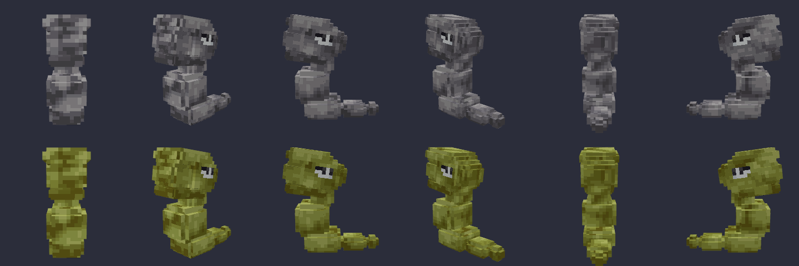
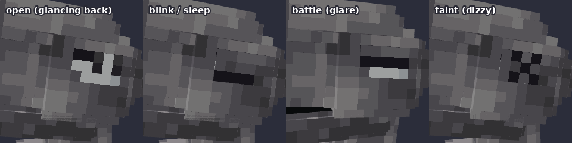
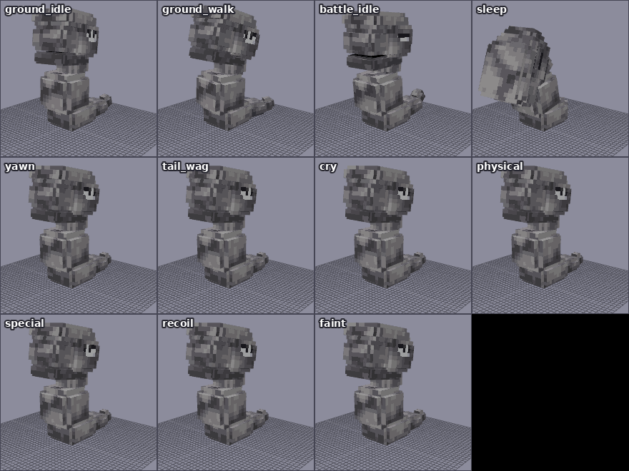

# 아기롱스톤 `babyonix` — Cobblemon Blockbench 모델

롱스톤의 아기(전 진화) 버전입니다. 원화처럼 둥글게 말린 아랫몸으로 서 있는 작은 바위 뱀으로 만들었습니다.
- 윗면이 평평하고 주둥이가 긴 바위 머리
- 무거운 눈두덩 아래 반쯤 감긴 옆눈 (뒤쪽을 흘끗 보는 모습)
- 짧은 목과 커다란 몸통 바위
- 바닥에 누운 꼬리 끝의 납작한 바위와 작고 동그란 바위




## 텍스처: 롱스톤 텍스처를 그대로 사용

이번에는 색만 뽑지 않고, Cobblemon 공식 롱스톤 텍스처(`0095_onix/onix.png`)의 **픽셀 자체**를 옮겨 썼습니다.

- 아기롱스톤의 바위 10개(머리 5개, 목, 몸통, 아랫몸, 꼬리 2개)는 각각 롱스톤의 바위(boulder1~14) 하나를 작게 줄인 것입니다. 각 면에는 그 바위의 같은 면 무늬가 들어갑니다.
- 롱스톤 조약돌 무늬 하나는 10~20픽셀이라, 작은 아기 바위에 1:1로 자르면 조각나서 롱스톤처럼 보이지 않았습니다. 그래서 최대 1.5배로 줄이면서 어두운 균열선은 살리고 나머지는 평균을 냈습니다. 여러 축소 방법을 원본과 나란히 놓고 비교해서 골랐습니다.
- 바위 하나를 이루는 모서리 상자 3개는 같은 무늬를 나눠 써서 모서리에서 무늬가 끊기지 않습니다. 둥근 느낌이 나도록 밝은 쪽은 한 단계 밝게, 아랫면과 그늘은 한 단계 어둡게 했습니다.
- **이로치:** 롱스톤의 회색 6단계와 이로치 올리브색 6단계는 `onix.png`와 `onix_shiny.png`에서 같은 픽셀끼리 1:1로 대응합니다. 그래서 같은 무늬를 이로치 색으로 바꿔 칠하면 공식 이로치 롱스톤과 똑같은 올리브색 바위가 됩니다.
- **눈·입:** 눈의 흰자·균열선 색과 입 안의 검은색도 롱스톤 텍스처에서 가져왔습니다. 동공이 세로로 긴 것도 롱스톤과 같습니다.

| 텍스처 | 파일 | 내용 |
|---|---|---|
| 기본 | `babyonix.png` | 롱스톤 회색 바위 무늬 |
| 이로치 | `babyonix_shiny.png` | 롱스톤 이로치 올리브색 바위 무늬 |
| 알파 | `babyonix_alpha.png` | 빨갛게 빛나는 눈 (흰자는 밝은 빨강, 홍채는 어두운 빨강. 롱스톤 알파와 같은 방식) |

크기는 128×128, Box UV입니다. 원본 롱스톤 파일은 `tools/modelgen/pokemon/babyonix/source/`에 라이선스와 함께 들어 있습니다.

## 모델

- 큐브 40개, 본 29개 (로케이터 포함), Bedrock Entity 형식, Box UV
- 본 구조: `babyonix`(루트) → `body`(아랫몸)
  - `torso`(몸통 바위) → `neck` → `head`(`jaw`, `iris_*`, 표정 판)
  - `tail` → `tail_tip`
- 바위마다 모서리를 깎은 상자 3개를 겹쳐서 둥글게 보이게 했습니다.
- `jaw`: 머리 아래쪽 판이 턱입니다. x축 음수로 돌리면 입이 벌어지고 검은 입 안이 보입니다.
- `iris_right` / `iris_left`: 홍채(흰 빛 한 줄이 들어간 진회색)는 따로 떨어진 판입니다. 평소에는 원화처럼 뒤쪽을 흘끗 보고, 애니메이션에서 z 방향으로 움직여 앞을 봅니다.
- 표정 판: `eyes_closed_*`(감은 눈), `eyes_glare_*`(배틀 때 째려보는 반쯤 감긴 눈. 아래쪽이 투명해서 홍채가 보임), `eyes_happy_*`(웃는 눈), `eyes_dizzy_*`(기절 X 눈)
  - 눈이 머리 옆면에 있어서 좌우 판이 따로 있습니다. 평소에는 머리 안쪽에 숨어 있다가 x 방향으로 0.5 밖으로 밀면 나타납니다.
- 로케이터: `root`, `top`, `middle`, `target`, `head`, `item_hat`, `face`, `item_face`, `mouth`, `item`, `eye_right`, `eye_left`, `tail`, `tail_tip`, `special`



## 애니메이션 12종



| 이름 (`animation.babyonix.*`) | 내용 |
|---|---|
| `ground_idle` | 뱀처럼 목과 머리를 천천히 흔들고, 꼬리 끝 바위가 까딱이며, 홍채가 앞뒤로 흘끗거림 |
| `ground_walk` | 몸을 좌우로 물결치듯 흔들며 기어가기 (흔들림이 머리에서 꼬리 끝으로 전달됨) |
| `battle_idle` | 몸을 세우고 고개를 숙여 째려보기, 꼬리 끝을 들고 방울뱀처럼 떨기 |
| `sleep` | 머리를 몸 앞에 내려놓고 꼬리를 둥글게 말아 잠, 눈 감음 |
| `blink` | 눈 깜빡임 (퀴크) |
| `yawn` | 몸을 쭉 펴며 입을 크게 벌려 하품 (퀴크) |
| `tail_wag` | 뒤돌아 자기 꼬리를 보며 강아지처럼 꼬리를 흔듦, 웃는 눈 (퀴크) |
| `cry` | 몸을 세우고 입을 벌려 포효. 울음소리는 `pokemon.onix.cry` |
| `physical` | 뒤로 젖혔다가 바위 머리로 내려찍기 |
| `special` | 꼬리를 등 뒤로 높이 휘둘렀다가 땅에 내리꽂기 (바위 던지기 느낌) |
| `recoil` | 맞고 뒤로 밀리며 눈을 감음 |
| `faint` | X 눈으로 비틀거리다 옆으로 쓰러짐 (3초, 공식 기절 애니메이션과 같은 길이) |

포저(`posers/babyonix/babyonix.json`)의 포즈는 배틀 대기, 대기, 기어가기, 수면입니다. 대기 중에는 깜빡임과, 20~45초마다 하품 또는 꼬리 흔들기 퀴크가 나옵니다. 공식 롱스톤처럼 물속에서도 대기(`FLOAT`)·기어가기(`SWIM`) 포즈를 씁니다. 고개는 `q.look('head')` 로 플레이어를 바라봅니다.

## 파일

```
blockbench/babyonix.bbmodel                                        ← Blockbench 원본 (텍스처 3장·애니메이션 12종 내장)
assets/cobblemon/bedrock/pokemon/models/babyonix/babyonix.geo.json
assets/cobblemon/bedrock/pokemon/animations/babyonix/babyonix.animation.json
assets/cobblemon/bedrock/pokemon/posers/babyonix/babyonix.json
assets/cobblemon/bedrock/pokemon/resolvers/babyonix/0_babyonix_base.json
assets/cobblemon/textures/pokemon/babyonix/babyonix.png, babyonix_shiny.png, babyonix_alpha.png
tools/modelgen/pokemon/babyonix/                                   ← model.js(형태·텍스처 옮기기), anims.js, cobblemon.js, source/(원본 롱스톤)
```

## 게임에 넣기 (Cobblemon 1.8.1 / Minecraft 1.21.1)

1. 다른 포켓몬과 같은 리소스팩입니다. `pack.mcmeta` 와 `assets/` 폴더를 zip 하나로 묶어 `.minecraft/resourcepacks` 에 넣고 켭니다.
2. 이번 작업은 **모델링(클라이언트 파일)만** 포함합니다. 게임에 나오려면 종족 데이터가 따로 있어야 합니다.
   - 종족 id는 `babyonix` 여야 합니다 (리졸버가 `cobblemon:babyonix` 에 연결됨).
   - 추천 크기: `baseScale` 0.5 (약 1블록 높이), `hitbox` 너비 0.6 · 높이 0.9 정도.
3. 종족을 추가한 뒤 `/pokespawn babyonix`, `/pokespawn babyonix shiny` 로 확인합니다.

## Blockbench에서 수정하기

- `blockbench/babyonix.bbmodel` 을 Blockbench로 엽니다 (Bedrock Entity, Box UV).
- 내보내기는 다른 포켓몬과 같습니다: Bedrock Geometry → `models/babyonix/`, 모든 애니메이션 저장 → `animations/babyonix/`, 텍스처 → `textures/pokemon/babyonix/`.

## 검증한 것

- **내보내기 일치**: 내보낸 `.geo.json` + `.animation.json` 을 다시 읽어 렌더링한 결과가 `.bbmodel` 과 14개 포즈에서 픽셀 단위로 같습니다 (`npm run verify`).
- **바닥 접촉**: 모든 애니메이션의 가장 낮은 점을 시간별로 확인했습니다 (`npm run check`, 오차 0.03 이내). 옆으로 쓰러지는 기절은 기울기 각도마다 필요한 높이를 재서 맞췄습니다. 꼬리를 내리꽂는 특수 공격이 땅을 뚫고 들어가던 것도 고쳤습니다.
- **표정 판 위치**: 모든 표정 판이 나타났을 때 홍채보다 앞에 오고 서로 겹치지 않는지 확인했습니다 (기절 눈이 머리 안에 묻혀 안 보이던 것을 고침).
- **텍스처**: 렌더링한 공식 롱스톤 옆에 놓고 같은 재질로 보이는지 비교했습니다.
- **Cobblemon 형식**: 리졸버·포저·울음소리 이름(`pokemon.onix.cry`)은 Cobblemon 1.8.1의 공식 롱스톤 파일과 `sounds.json` 을 보고 맞췄습니다.

## 확인하지 못한 것

- 실제 마인크래프트 클라이언트에서는 테스트하지 못했습니다. 미리보기는 Blockbench와 같은 방식으로 그리는 자체 3D 뷰어로 렌더링한 것입니다.
- 종족 데이터가 없어서 게임 속 실제 크기와 히트박스는 종족을 추가한 뒤 확인이 필요합니다.

## 출처와 라이선스

바위 텍스처는 Cobblemon 팀의 롱스톤 텍스처(Cobblemon 에셋, **CC BY-NC 3.0**)를 잘라 줄이고 다시 음영을 넣은 2차 저작물입니다. 비상업적으로만 쓸 수 있고, 배포할 때 이 출처 표기를 유지해야 합니다. 원본 파일과 라이선스 전문은 `tools/modelgen/pokemon/babyonix/source/` 에 있습니다. 모델 형태, 눈, 애니메이션은 새로 만든 것입니다.
