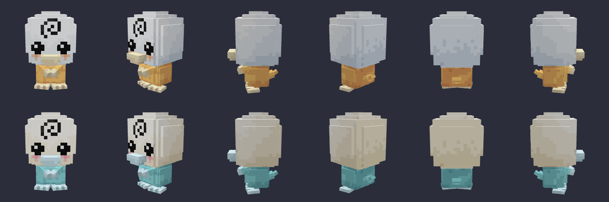
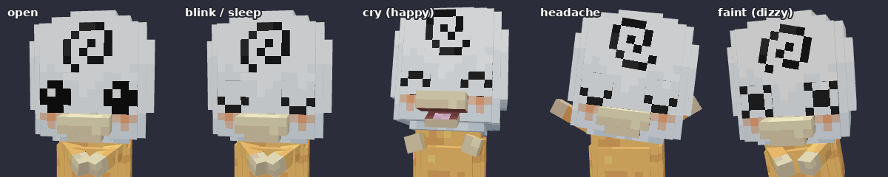
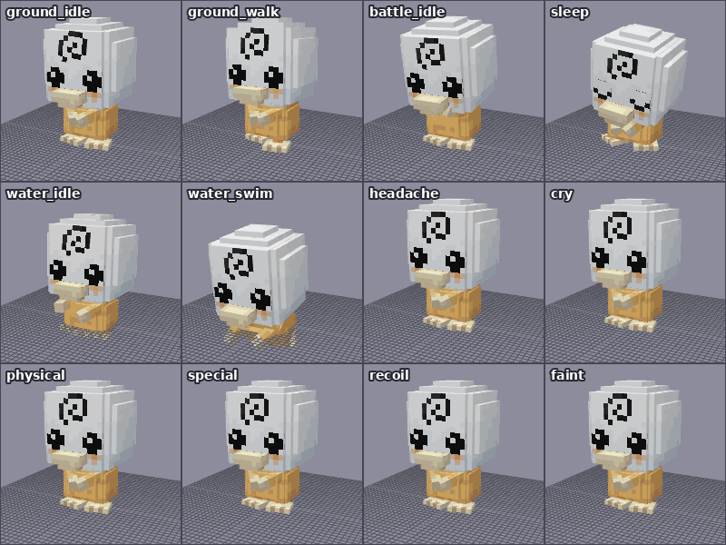

# 아기고라파덕 `babypsyduck` — Cobblemon Blockbench 모델

고라파덕의 아기(전 진화) 버전 모델입니다. 원화의 흰 알껍데기 같은 둥근 머리, 이마의 검은 소용돌이, 반짝이는 검은 눈, 크림색 부리, 주황 볼터치, 배 앞에 모은 짧은 팔, 크림색 물갈퀴 발을 Cobblemon 스타일 큐브 모델로 만들었습니다.




## 텍스처 (고라파덕 텍스처 기반)

몸, 부리, 발, 입 안, 눈, 소용돌이 색은 Cobblemon 공식 고라파덕 텍스처(`0054_psyduck/psyduck.png`, `psyduck_shiny.png`)에서 그대로 뽑은 색입니다. 고라파덕과 같은 5단계 색 단계와 얼룩덜룩한 질감으로 칠했습니다.

| 텍스처 | 파일 | 내용 |
|---|---|---|
| 기본 | `babypsyduck.png` | 고라파덕 노란 몸 + 크림색 부리·손·발, 연한 하늘색 그림자가 지는 흰 머리, 주황 볼터치 |
| 이로치 | `babypsyduck_shiny.png` | 이로치 고라파덕의 하늘색 몸 + 푸른빛 흰 부리·손·발. 부리가 머리와 구분되도록 머리는 따뜻한 크림색, 볼터치는 분홍 |
| 알파 | `babypsyduck_alpha.png` | 알파 포켓몬의 빨갛게 빛나는 눈 (`alpha_eyes` 발광 레이어, 공식 포켓몬과 같은 방식) |

크기는 128×64이고, Box UV라 Blockbench에서 바로 칠할 수 있습니다.

## 모델

- 29 큐브, 32 본 (로케이터 포함), Bedrock Entity 형식, Box UV
- 본 구조: `babypsyduck`(루트) → `body` → `torso` → `head` / `arm_*` → `hand_*` / `tail` → `tail2`, `body` → `foot_*`
- 머리: 얼굴판 + 폭이 다른 상자 4개 + 위아래 뚜껑으로 만든 계단식 공 모양
- `swirl`: 이마의 소용돌이는 따로 떨어진 판이라 애니메이션에서 회전·확대됩니다 (배틀 대기 때 천천히 돌고, 특수 공격 때 빠르게 돌며 커짐)
- `beak` / `jaw`: 부리와 아래턱. `jaw` 를 x축 음수로 돌리면 입이 벌어지고 안쪽(입천장, 혀)이 보입니다
- 표정 판: `eyes_closed`(감은 눈 ‿), `eyes_happy`(웃는 눈 ^^), `eyes_dizzy`(기절 X 눈). 평소에는 얼굴 표면 0.4 안쪽에 숨어 있고, 애니메이션에서 z 방향으로 -0.45 밀면 얼굴 앞에 나타납니다. Cobblemon 공식 모델과 같은 방식입니다
- 로케이터: `root`, `top`, `middle`, `target`, `head`, `item_hat`, `face`, `item_face`, `mouth`, `eye_right`, `eye_left`, `special`(소용돌이), `hand_primary`, `physical`, `hand_secondary`, `item`, `tail`



## 애니메이션 13종



| 이름 (`animation.babypsyduck.*`) | 내용 |
|---|---|
| `ground_idle` | 숨쉬기, 머리를 천천히 갸웃거림, 소용돌이 살짝 흔들림, 가끔 손뼉 치듯 팔을 벌렸다 모음, 꼬리 흔들기 |
| `ground_walk` | 짧은 다리로 뒤뚱뒤뚱 걷기 (몸통이 좌우로 기울고, 발이 번갈아 들림) |
| `water_idle` | 알처럼 물에 동동 떠서 흔들리며 발과 팔로 물장구 |
| `water_swim` | 앞으로 기울어 발차기와 팔 젓기로 헤엄 |
| `battle_idle` | 통통 튀며 두 팔을 들고 대기, 이마 소용돌이가 천천히 회전 |
| `sleep` | 주저앉아 고개를 꾸벅, 눈을 감고 부리를 살짝 벌림 |
| `blink` | 눈 깜빡임 (퀴크) |
| `headache` | 고라파덕의 두통 포즈: 두 손으로 머리를 감싸고 눈을 질끈 감은 채 좌우로 흔들림 (대기 중 20~50초마다 나오는 퀴크) |
| `cry` | 부리를 들고 입을 크게 벌리며 웃는 눈, 팔을 번쩍. 울음소리는 `pokemon.psyduck.cry` |
| `physical` | 뒤로 움츠렸다가 큰 머리로 박치기 |
| `special` | 머리를 감싸 쥐고 떨며 소용돌이가 빠르게 돌며 커지다가, 두 손을 앞으로 뻗으며 염력을 발사 |
| `recoil` | 맞고 뒤로 밀리며 눈을 감고 팔을 허우적 |
| `faint` | X 눈으로 비틀거리다 무거운 머리 때문에 뒤로 벌러덩 (3초, 공식 기절 애니메이션과 같은 길이) |

포저(`posers/babypsyduck/babypsyduck.json`)의 포즈: 배틀 대기, 대기(+깜빡임, 두통 퀴크), 걷기, 물 위(`FLOAT`), 수영(`SWIM`), 수면, 어깨 왼쪽/오른쪽. 고개는 `q.look('head')` 로 플레이어를 바라봅니다.

## 파일

```
blockbench/babypsyduck.bbmodel                                     ← Blockbench 원본 (텍스처 3장·애니메이션 13종 내장)
assets/cobblemon/bedrock/pokemon/models/babypsyduck/babypsyduck.geo.json
assets/cobblemon/bedrock/pokemon/animations/babypsyduck/babypsyduck.animation.json
assets/cobblemon/bedrock/pokemon/posers/babypsyduck/babypsyduck.json
assets/cobblemon/bedrock/pokemon/resolvers/babypsyduck/0_babypsyduck_base.json
assets/cobblemon/textures/pokemon/babypsyduck/babypsyduck.png, babypsyduck_shiny.png, babypsyduck_alpha.png
pack.mcmeta                                                        ← 리소스팩 (Minecraft 1.21.1, pack_format 34)
tools/modelgen/                                                    ← 모델·텍스처·애니메이션을 다시 생성하는 도구 (모든 포켓몬 공용)
```

## 게임에 넣기 (Cobblemon 1.8.1 / Minecraft 1.21.1)

1. `pack.mcmeta` 와 `assets/` 폴더를 zip 하나로 묶어 `.minecraft/resourcepacks` 에 넣고 리소스팩을 켭니다.
2. 이번 작업은 **모델링(클라이언트 파일)만** 포함합니다. 게임에 포켓몬으로 나오려면 종족 데이터가 따로 있어야 합니다.
   - 종족 id는 반드시 `babypsyduck` 이어야 합니다 (리졸버가 `cobblemon:babypsyduck` 에 연결됨). 다른 이름을 쓰려면 리졸버의 `species` 값을 바꾸세요.
   - 추천 크기: `baseScale` 0.32 (고라파덕 0.8의 절반 정도 키), `hitbox` 너비 0.5 · 높이 0.55 정도.
   - 어깨 탑승(`shoulderMountable`)을 켜면 포저의 어깨 포즈가 쓰입니다. 어깨 위치(`transformedParts` 의 ±8.8)는 `baseScale` 0.32 기준입니다.
3. 종족을 추가한 뒤 `/pokespawn babypsyduck`, `/pokespawn babypsyduck shiny` 로 확인합니다.

## Blockbench에서 수정하기

- `blockbench/babypsyduck.bbmodel` 을 Blockbench로 엽니다 (Bedrock Entity, Box UV — Cobblemon 공식 모델과 같은 형식).
- 수정 후 내보내기:
  - 파일 → 내보내기 → Bedrock Geometry → `assets/cobblemon/bedrock/pokemon/models/babypsyduck/babypsyduck.geo.json`
  - 애니메이션 탭 → 모든 애니메이션 저장 → `assets/cobblemon/bedrock/pokemon/animations/babypsyduck/babypsyduck.animation.json`
  - 텍스처 → 다른 이름으로 저장 → `assets/cobblemon/textures/pokemon/babypsyduck/`
- 게임 UI에서 초상화(파티 슬롯)나 요약 화면 크기가 어색하면 포저의 `portraitScale/portraitTranslation`, `profileScale/profileTranslation` 값을 조정합니다.

## 검증한 것

- **내보내기 일치**: 내보낸 `.geo.json` + `.animation.json` 을 다시 읽어 렌더링한 결과가 `.bbmodel` 렌더링과 14개 포즈(모든 애니메이션 포함)에서 픽셀 단위로 같습니다 (`npm run verify`).
- **바닥 접촉**: 모든 애니메이션을 시간별로 샘플링해 가장 낮은 점을 확인했습니다. 발이 땅에 박히거나 공중에 뜨는 곳이 없습니다 (의도한 점프·튕김 제외, 물 애니메이션은 물속).
- **Cobblemon 형식**: 리졸버, 포저, 애니메이션 형식과 기절 애니메이션 길이(3초, loop 없음)는 Cobblemon 1.8.1의 공식 고라파덕·피츄·푸린 파일과 대조했습니다.
- **초상화·프로필 위치**: Cobblemon GUI 계산식을 옮긴 도구(`portrait.js`)로 머리 전체가 파티 슬롯에 들어오도록 맞췄습니다.

## 확인하지 못한 것

- 실제 마인크래프트 클라이언트에서는 테스트하지 못했습니다. 미리보기는 Blockbench와 같은 방식으로 그리는 자체 3D 뷰어로 렌더링한 것입니다.
- 종족 데이터가 없어서 게임 속 실제 크기, 히트박스, 어깨 위치는 종족을 추가한 뒤 확인이 필요합니다.

## 재생성 도구 (`tools/modelgen`)

진화형 [스월덕](../swirlduck/README.md), [아기롱스톤](../babyonix/README.md), [케르베가](../cerbedoom/README.md)와 같은 도구를 씁니다.

```bash
cd tools/modelgen
npm install                     # three, pngjs (+ 미리보기용 playwright)
npm run export                  # 모든 포켓몬 빌드 → blockbench/, assets/ 다시 쓰기 (node build.js babypsyduck --repo ../.. 로 하나만)
npm run verify                  # 내보낸 geo/animation 과 .bbmodel 픽셀 비교
npm run check                   # 애니메이션별 가장 낮은 점 (바닥에 박힘/뜸 확인)
npm run previews                # docs/ 이미지·GIF 다시 만들기 (python3 + Pillow 필요)
```

- `pokemon/babypsyduck/model.js`: 형태, 색(고라파덕 팔레트), 얼굴·소용돌이·표정 판 / `anims.js`: 애니메이션 / `cobblemon.js`: 포저·리졸버
- Blockbench에서 직접 수정하기 시작했다면 그때부터는 `.bbmodel` 이 원본입니다. `npm run export` 는 수정한 파일을 덮어씁니다.

## 출처

색 팔레트는 Cobblemon 팀의 고라파덕 텍스처(Cobblemon 에셋, CC BY-NC 3.0)에서 가져왔습니다. 모델 형태, 텍스처 그림, 애니메이션은 새로 만든 것입니다.
