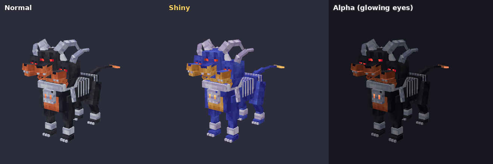
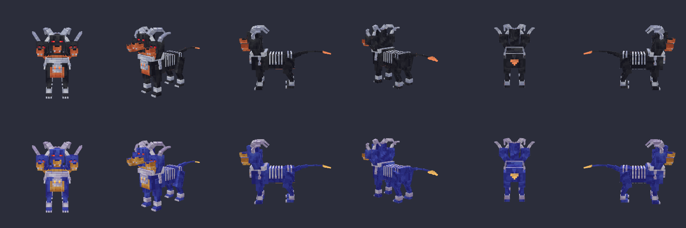
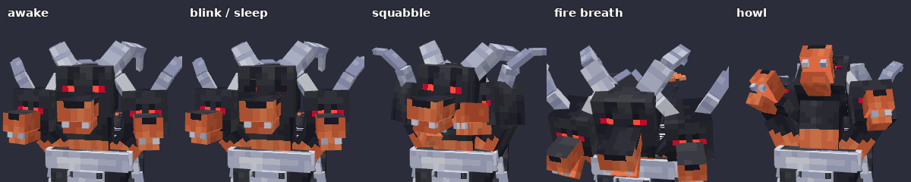
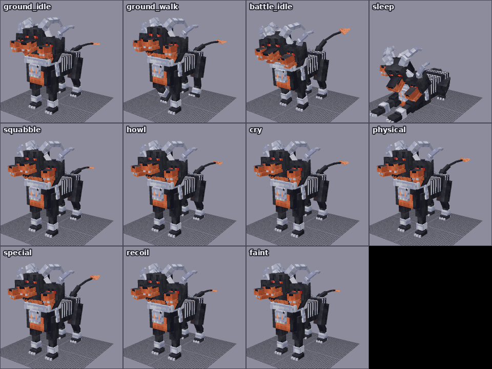

# 케르베가 `cerbedoom` (가칭) — 헬가의 새로운 진화, Cobblemon Blockbench 모델

헬가의 새 진화형입니다. 이번에는 원화 없이 **컨셉 자료와 모티브를 직접 조사해서** 디자인했습니다. 텍스처는 헬가 텍스처를 그대로 사용하는 기존 방식입니다.





## 1. 컨셉 조사 (새로운 방법)

### 헬가는 무엇을 바탕으로 만들어졌나
- 헬가는 신화 속 **지옥견(hellhound)**, 곧 저승의 문을 지키는 악마 개를 바탕으로 합니다. 케르베로스와 연결하는 해석이 많습니다.
- 뼈 장식, 끝이 뾰족한 꼬리, 숫양 뿔은 전형적인 악마의 상징입니다. 색과 체형은 **도베르만 핀셔**를 닮았습니다. ([Pokémon GO Hub](https://pokemongohub.net/post/article/houndoom-lore-origins/), [Bulbapedia](https://bulbapedia.bulbagarden.net/wiki/Houndoom_(Pok%C3%A9mon)))
- 도감 설정 ([Pokémon Database](https://pokemondb.net/pokedex/houndoom))
  - 무리에서 **뿔이 뒤로 가장 크게 젖혀진 개체가 우두머리**이고, 싸워서 우두머리를 정합니다.
  - 입에서 뿜는 불꽃에 데면 그 아픔이 영원히 가시지 않습니다.
  - 불꽃은 몸속의 독소가 타면서 나옵니다.
- 메가헬가는 뿔이 길어지고, 가슴에 해골 모양 구조물이 생기고, 꼬리가 갈라지고, 발톱이 붉어집니다 ([Pokémon Wiki](https://pokemon.fandom.com/wiki/Houndoom)). 이번 진화형은 메가진화와 겹치지 않게 방향을 잡았습니다.

### 모티브로 삼은 신화와 민담
| 모티브 | 조사한 내용 | 디자인에 쓴 곳 |
|---|---|---|
| **케르베로스** (그리스) | 저승 하데스의 문을 지키는 거대한 개로, 죽은 자가 나가지 못하게 막습니다. 미술에서는 거의 늘 머리 셋, 뱀 꼬리로 그려지고, 세 머리는 과거·현재·미래를 뜻한다고 합니다 ([Theoi](https://www.theoi.com/Ther/KuonKerberos.html), [GreekMythology.com](https://www.greekmythology.com/Myths/Creatures/Cerberus/cerberus.html)) | 머리 셋, 길게 휘어지는 뱀 같은 꼬리 |
| **가름 (Garmr)** (북유럽) | 헬의 입구 그니파헬리르 동굴 앞에 사슬로 묶인 개입니다. 가슴과 목이 피로 얼룩져 있고, 눈이 잉걸불처럼 빛난다고도 합니다. 그 울부짖음은 라그나로크의 징조입니다 ([Mythlok](https://mythlok.com/garmr/), [Gnipahellir](https://en.wikipedia.org/wiki/Gnipahellir)) | 끊어진 사슬, 그을린 주황색 가슴, 빛나는 눈, 하울링 퀴크 |
| **영국 민담의 검은 개** (블랙 셕, 바게스트, 처치 그림) | 송아지만 한 검은 개로, 붉게 타오르는 눈을 가졌습니다. 바게스트는 사슬 소리를 내며 걸어 다니고, 모두 죽음을 알리는 징조입니다 ([Discovery UK](https://www.discoveryuk.com/mysteries/black-shuck-the-devil-dog-of-english-folklore/), [Barghest](https://en.wikipedia.org/wiki/Barghest)) | 헬가보다 한 단계 큰 덩치, 어둠에서 빛나는 빨간 눈(발광 레이어), 사슬 |
| **헬가 자신** | 해골 목걸이, 등의 갈비뼈, 발목의 뼈 고리, 숫양 뿔, 화살촉 꼬리, 주황색 주둥이·가슴 | 모두 한 단계씩 자랐습니다 (아래 표) |

### 기존 팬 디자인 확인
케르베로스 모티브의 헬가는 팬들 사이에서도 흔한 발상입니다. 예를 들어 케르베로스를 바탕으로 한 팬메이드 메가헬가 그림이 있습니다 ([DeviantArt, pokeluka](https://www.deviantart.com/pokeluka/art/Mega-Houndoom-FAN-MADE-393898371)). 이런 그림은 참고하지 않았습니다. 신화 자료와 헬가 공식 디자인만 조합해서 새로 만들었습니다.

### 이름 (가칭)
**케르베가** = 케르베로스 + 헬가, 영어 **Cerbedoom** = Cerberus + Houndoom. id는 `cerbedoom`입니다. 원하는 이름이 있으면 `tools/modelgen/pokemon/cerbedoom/` 의 `model.js`·`cobblemon.js` 에서 `ID`를 바꾸고 폴더 이름도 바꾼 뒤 `npm run export` 하면 됩니다.

## 2. 디자인: 문을 지키는 세 머리의 지옥견

| 부위 | 헬가 → 케르베가 |
|---|---|
| 머리 | 1개 → **3개**. 가운데는 우두머리라 가장 크고, 뿔이 가장 크게 뒤로 젖혀졌습니다 (헬가 도감의 우두머리 설정). 양옆 머리는 조금 작고 뿔이 앞으로 말립니다 |
| 목걸이 | 해골 장식 → 세 목을 두르는 **뼈 목걸이**. 가슴에는 저승문의 자물쇠 같은 **큰 해골**이 달렸고, 눈구멍이 불씨처럼 빛납니다 |
| 사슬 | (새로 추가) 목걸이 양옆에 **끊어진 척추뼈 사슬** (가름이 묶여 있던 사슬) |
| 가슴 | 주황색 무늬 → **그을린 주황색 가슴과 배** (가름의 피 묻은 가슴) |
| 등 | 갈비뼈 → 몸통과 엉덩이까지 이어지는 **더 많은 갈비뼈** |
| 다리 | 발목 뼈 고리 유지, 헬가처럼 뒷다리가 꺾이는 체형 |
| 꼬리 | 화살촉 꼬리 → 여러 마디로 휘어지는 **뱀 같은 긴 꼬리**(케르베로스). 끝은 **불씨처럼 빛나는 화살촉** |
| 입 | 불꽃 → 입을 벌리면 입 안이 **잉걸불처럼 빛남** (발광 레이어) |
| 눈 | 빨간 눈 → 어둠 속에서 **빛나는 빨간 눈** (검은 개 민담) |
| 성격 | 세 머리가 **각자 따로 움직입니다**. 두리번거리다 서로 으르렁대고, 차례로 울부짖습니다. 잘 때도 **한 머리는 깨어서 망을 봅니다** (케르베로스는 문을 비우지 않는다) |

## 3. 텍스처: 헬가 텍스처 사용 (기존 방식)

Cobblemon 공식 헬가 텍스처(`0229_houndoom/houndoom.png`)로 만들었습니다.
- **재질별 픽셀 복사:** 헬가 텍스처의 모든 색은 털(검정 5단계), 주황(5단계), 뼈(흰색 5단계) 중 하나에 속합니다. 헬가 텍스처에서 **순수한 털·주황·뼈 영역**(털 68×9 등)을 찾아서, 케르베가의 각 면에 그 픽셀을 **1:1**로 옮겼습니다. 헬가와 같은 픽셀 밀도라 얼룩 무늬도 똑같습니다.
- **입체감:** 둥근 느낌이 나도록 밝은 쪽은 헬가 단계 안에서 한 단계 밝게, 그늘은 한 단계 어둡게 했습니다. 모든 색이 헬가 텍스처의 색입니다.
- **이로치:** 헬가의 색 하나하나는 `houndoom_shiny.png`의 색 하나와 정확히 대응합니다 (검정 털 → 파란 털, 주황 → 금색, 뼈 → 연보라). 같은 픽셀을 그 색으로 칠해서 **공식 이로치 헬가와 같은 파랑·금색**이 됩니다.
- 눈의 빨강, 입 안의 검붉은색, 혀의 분홍색도 헬가 텍스처의 색입니다.

| 텍스처 | 파일 | 내용 |
|---|---|---|
| 기본 | `cerbedoom.png` | 헬가의 검정 털, 주황, 흰 뼈 |
| 이로치 | `cerbedoom_shiny.png` | 헬가 이로치의 파란 털, 금색, 연보라 뼈 |
| 발광 | `cerbedoom_emissive.png`, `cerbedoom_emissive_shiny.png` | 빛나는 빨간 눈, 입 안의 잉걸불(입을 벌릴 때만 보임), 가슴 해골의 눈구멍, 꼬리 화살촉 가장자리 |
| 알파 | `cerbedoom_alpha.png` | 세 머리의 눈이 모두 빨갛게 빛남 |

크기는 256×128, Box UV입니다. 좌우 대칭 부위(다리, 사슬, 양옆 목·머리)는 mirror UV로 텍스처를 같이 씁니다. 원본 헬가 파일은 `tools/modelgen/pokemon/cerbedoom/source/`에 라이선스와 함께 들어 있습니다.

## 4. 모델

- 큐브 95개, 본 69개 (로케이터 포함), Bedrock Entity 형식, Box UV
- 본 구조: `cerbedoom`(루트) → `body`
  - `torso` → `collar`(`chain_*`), `tail` → … → `tail_tip`, `neck` → `head`, `neck_right` → `head_right`, `neck_left` → `head_left`
  - `body` → `leg_front_*` → `leg_front_*2` → `paw_front_*`
  - `body` → `leg_back_*` → `leg_back_*2` → `leg_back_*3` → `paw_back_*`
- 머리 3개는 각각 `_jaw`(턱), `_horn_*`(뿔 세 마디), `_eyes_closed`(감은 눈 판)를 가집니다. 감은 눈 판은 머리 안쪽에 숨어 있다가 앞으로 0.5 밀면 나타나서, 세 머리가 따로 눈을 감을 수 있습니다.
- 등의 갈비뼈는 헬가처럼 몸통을 살짝 부풀린 덮개 큐브에 그렸고, 뼈 사이는 투명합니다.
- 로케이터: `root`, `top`, `middle`, `target`, `head`, `item_hat`, `face`, `item_face`, `mouth`, `special`, `item`, `eye_right`, `eye_left`, `mouth_right`, `mouth_left`, `foot_primary`, `physical`, `tail`



## 5. 애니메이션 12종



| 이름 (`animation.cerbedoom.*`) | 내용 |
|---|---|
| `ground_idle` | 숨쉬기. 세 머리가 각자 다른 속도로 두리번거리고, 오른쪽 머리는 헉헉거리며, 사슬이 흔들리고 꼬리가 물결침 |
| `ground_walk` | 대각선 다리가 함께 움직이는 네발 걸음. 머리들이 서로 엇박자로 흔들리고 꼬리가 좌우로 휘어짐 |
| `battle_idle` | 몸을 낮추고 세 머리가 번갈아 이빨을 드러내며 으르렁. 꼬리를 치켜들고 휘두름 |
| `sleep` | 엎드려 뒷다리를 접고 가운데·왼쪽 머리는 잠듦. **오른쪽 머리는 깨어서 천천히 주위를 살핌** |
| `blink` | 세 머리가 조금씩 엇갈려 깜빡임 (퀴크) |
| `squabble` | 양옆 머리가 서로 물어뜯으려 하다가, 우두머리가 끼어들어 한 번 물자 둘 다 움찔 (퀴크) |
| `howl` | 세 머리가 차례로 고개를 들고 울부짖음 (퀴크, 가름의 울부짖음) |
| `cry` | 세 머리가 차례로 포효. 울음소리는 `pokemon.houndoom.cry` |
| `physical` | 달려들며 세 머리가 차례로 물기 |
| `special` | 세 머리가 뒤로 젖혔다가 입을 크게 벌리고 불꽃을 뿜음 (입 안이 빛남) |
| `recoil` | 맞고 뒤로 밀리며 세 머리 모두 눈을 감음 |
| `faint` | 다리가 풀려 주저앉고, 오른쪽·왼쪽·가운데 순서로 머리가 떨어지며 눈을 감음 (3초) |

포저(`posers/cerbedoom/cerbedoom.json`)의 포즈는 배틀 대기, 대기, 걷기, 수면입니다. 대기 중에는 깜빡임과, 20~50초마다 다툼 또는 하울링 퀴크가 나옵니다. 가운데 우두머리 머리가 `q.look('head')` 로 플레이어를 보고, 양옆 머리는 따로 두리번거립니다. 헬가처럼 물에서도 대기(`FLOAT`)·걷기(`SWIM`) 포즈를 씁니다.

## 6. 파일

```
blockbench/cerbedoom.bbmodel                                       ← Blockbench 원본 (텍스처 5장·애니메이션 12종 내장)
assets/cobblemon/bedrock/pokemon/models/cerbedoom/cerbedoom.geo.json
assets/cobblemon/bedrock/pokemon/animations/cerbedoom/cerbedoom.animation.json
assets/cobblemon/bedrock/pokemon/posers/cerbedoom/cerbedoom.json
assets/cobblemon/bedrock/pokemon/resolvers/cerbedoom/0_cerbedoom_base.json
assets/cobblemon/textures/pokemon/cerbedoom/cerbedoom.png, _shiny, _emissive, _emissive_shiny, _alpha
tools/modelgen/pokemon/cerbedoom/                                  ← model.js(형태·헬가 텍스처 옮기기), anims.js, cobblemon.js, source/(원본 헬가)
```

## 7. 게임에 넣기 (Cobblemon 1.8.1 / Minecraft 1.21.1)

1. 다른 포켓몬과 같은 리소스팩입니다. `pack.mcmeta` 와 `assets/` 폴더를 zip 하나로 묶어 `.minecraft/resourcepacks` 에 넣고 켭니다.
2. 이번 작업은 **모델링(클라이언트 파일)만** 포함합니다. 게임에 나오려면 종족 데이터가 따로 있어야 합니다.
   - 종족 id는 `cerbedoom` 이어야 합니다 (리졸버가 `cobblemon:cerbedoom` 에 연결됨).
   - 헬가에서 진화하게 하려면 헬가 쪽에 진화를 추가하는 데이터(species_additions)도 필요합니다.
   - 추천: `baseScale` 0.8 (뿔 끝까지 약 2.4블록, 헬가 0.7보다 한 단계 큼), `hitbox` 너비 1.6 · 높이 2.6 정도. 타입은 헬가와 같은 악·불꽃을 추천합니다.
3. 종족을 추가한 뒤 `/pokespawn cerbedoom`, `/pokespawn cerbedoom shiny` 로 확인합니다.

## 8. 검증한 것

- **내보내기 일치**: 내보낸 `.geo.json` + `.animation.json` 을 다시 읽어 렌더링한 결과가 `.bbmodel` 과 14개 포즈에서 픽셀 단위로 같습니다 (`npm run verify`). mirror UV 부위도 포함입니다.
- **바닥 접촉**: 모든 애니메이션의 가장 낮은 점을 시간별로 확인했습니다 (`npm run check`).
  - 배틀 대기처럼 몸을 앞으로 숙이는 자세는 앞다리와 뒷다리를 따로 보정했습니다.
  - 엎드릴 때 접히는 뒷다리는 관절 각도 조합을 바꿔 가며 땅에 가장 잘 붙는 값을 골랐습니다.
  - 걷기는 발 높이 변화를 재서 몸의 위아래 흔들림을 맞췄습니다.
  - 오차는 약 0.3 이내입니다 (트롯 걸음에서 네 발이 모두 뜨는 순간 제외).
- **텍스처**: 헬가 텍스처에서 고른 영역이 정말 한 재질의 색으로만 되어 있는지 빌드할 때마다 픽셀 단위로 검사합니다. 이로치 색은 헬가 이로치 텍스처의 같은 위치 색과 1:1로 맞췄습니다.
- **Cobblemon 형식**: 포저·리졸버·발광 레이어·울음소리 이름(`pokemon.houndoom.cry`)은 Cobblemon 1.8.1의 공식 헬가·불켜미 파일과 `sounds.json` 을 보고 맞췄습니다.
- **다른 포켓몬 영향 없음**: 공용 도구에 기능을 하나 추가했습니다(회전한 본 위의 표정 판이 아래 텍스처를 복사하는 기능). 기존 세 포켓몬의 텍스처는 바이트 단위로 그대로입니다.

## 9. 확인하지 못한 것

- 실제 마인크래프트 클라이언트에서는 테스트하지 못했습니다. 미리보기는 Blockbench와 같은 방식으로 그리는 자체 3D 뷰어로 렌더링한 것입니다.
- 종족 데이터가 없어서 게임 속 실제 크기와 히트박스는 종족을 추가한 뒤 확인이 필요합니다.
- 조사 중 Bulbapedia와 Wikipedia 본문은 이 작업 환경에서 직접 열 수 없어서, 검색 결과의 요약으로 확인했습니다.

## 10. 출처와 라이선스

텍스처는 Cobblemon 팀의 헬가 텍스처를 재료로 만들었습니다. Cobblemon 저장소에서 헬가 폴더에는 별도 에셋 라이선스가 없어 저장소 전체의 **Mozilla Public License 2.0**을 따릅니다. 원본 파일과 라이선스 전문은 `tools/modelgen/pokemon/cerbedoom/source/` 에 있습니다. 모델 형태, 눈, 애니메이션, 컨셉은 새로 만든 것입니다.
