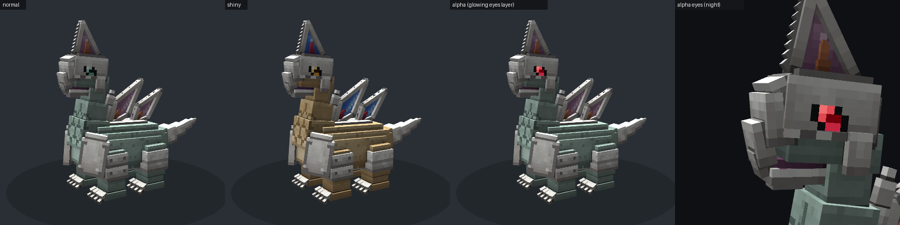
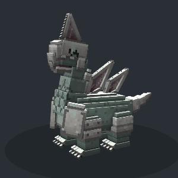
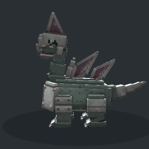
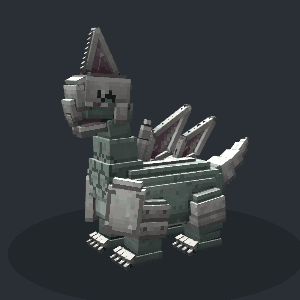
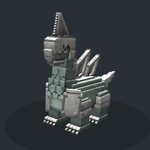
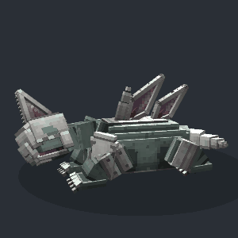
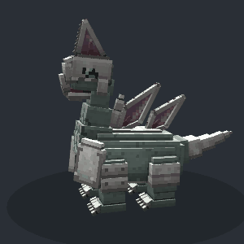

# Prismodon (가칭) — 폐기된 강철 용각류 포켓몬 · Cobblemon 1.8.1 모델

출시 직전에 폐기된 것으로 알려진 강철/바위 계열 용각류(목 긴 공룡) 디자인을 Cobblemon용
Blockbench(Bedrock Entity) 모델로 만든 것입니다. **모델링 에셋만** 들어 있습니다
(지오메트리, 텍스처, 애니메이션, poser, resolver). 종(species) 데이터는 포함하지 않았습니다.

> `prismodon`은 파일 이름을 붙이려고 정한 임시 이름입니다(“프리즘 + ‑odon”). 이름을 바꾸는 방법은 맨 아래에 있습니다.




## 포함된 파일

| 파일 | 설명 |
|---|---|
| `blockbench/prismodon.bbmodel` | Blockbench 프로젝트(텍스처 3장 + 애니메이션 12개 내장). Blockbench 5.2.1이 직접 컴파일한 파일입니다 |
| `assets/cobblemon/bedrock/pokemon/models/prismodon/prismodon.geo.json` | 지오메트리: 본 53개, 큐브 121개, 로케이터 19개, Box UV, 256×256 |
| `assets/cobblemon/bedrock/pokemon/animations/prismodon/prismodon.animation.json` | 애니메이션 12개 |
| `assets/cobblemon/bedrock/pokemon/posers/prismodon/prismodon.json` | Poser(1.8 MoLang 형식) |
| `assets/cobblemon/bedrock/pokemon/resolvers/prismodon/0_prismodon_base.json` | 기본 / 이로치 / 알파 변형 |
| `assets/cobblemon/textures/pokemon/prismodon/prismodon.png` | 기본 텍스처 |
| `assets/cobblemon/textures/pokemon/prismodon/prismodon_shiny.png` | 이로치 텍스처 |
| `assets/cobblemon/textures/pokemon/prismodon/prismodon_alpha.png` | 알파 개체용 발광 눈 레이어 |
| `tools/prismodon/` | 모든 에셋을 다시 만들어 내는 생성 스크립트와 미리보기 렌더러 |

## 디자인 해석

원화를 격자로 측정해서 비율을 맞췄습니다(발끝 0 기준 1유닛 = 1텍셀).

* **머리**: 기사 투구 같은 강철 헬멧. 앞쪽은 아래로 휘어진 부리형 코 가리개이고, 눈은 헬멧 옆면의 어두운 눈구멍 안에 있습니다. 뺨 가리개와 보라색 입안, 강철 아래턱이 있습니다.
* **볏**: 앞쪽 가장자리에 톱니가 난 삼각형 강철 프레임, 보라색 유리판, 아랫부분의 주황색 가시.
* **목**: 연녹색 목 앞쪽에 육각형 판 무늬가 있고, 가슴 쪽으로 갈라진 금이 이어집니다.
* **몸통**: 세이지색 통형 몸통. 가슴 앞쪽이 민트색으로 밝고, 배에는 마디진 강철판이 있습니다.
* **갑옷**: 가슴 모서리의 큰 어깨판(리벳 포함), 앞다리 팔찌 2단, 뒷다리 정강이 보호대(능선), 등의 강철 띠.
* **등판**: 뒤로 기운 마름모꼴 판 2장(강철 프레임 + 유리 + 주황 가시)과 목 뒤의 강철 지느러미.
* **꼬리**: 드릴 같은 강철 원뿔 꼬리.
* **발**: 굵은 코끼리형 다리에 발마다 아래로 굽은 발톱 4개.

### 변형(aspect)

| aspect | 결과 |
|---|---|
| (기본) | 세이지 그린 피부 · 은색 강철 · 자주 유리 · 주황 가시 · 청록 눈 |
| `shiny` | 사막 모래색 피부 · 사파이어 유리 · 진홍 가시 · 호박색 눈 |
| `alpha_eyes` | Cobblemon 1.8 알파 개체 방식의 발광(emissive) 빨간 눈 레이어. 공식 모델(Bastiodon, Tyrantrum 등)과 같은 구조입니다 |

## 애니메이션

| 이름 | 용도 | 비고 |
|---|---|---|
| `ground_idle` | 서 있기 | 호흡, 목 S자 흔들림, 꼬리·등판 흔들림 (4초 루프) |
| `ground_walk` | 걷기 | 대각선 다리 쌍 보행, 무릎 들기, 발바닥 수평 유지, 몸통 상하·좌우 흔들림 (1.6초) |
| `ground_run` | 달리기 | 보폭과 흔들림이 더 큼 (0.9초) |
| `battle_idle` | 전투 대기 | 낮은 자세, 벌린 다리, 입으로 숨쉬기 (2초) |
| `blink` | 눈 깜빡임 quirk | 눈꺼풀이 헬멧 안에서 튀어나와 눈을 덮음 |
| `cry` | 울음 | 머리를 들고 포효, 턱 벌림, 볏·등판 떨림 |
| `faint` | 기절 | 다리가 꺾이며 옆으로 쓰러짐, 눈 감김 (마지막 프레임 유지) |
| `sleep` | 수면 | 엎드려 턱을 땅에 댐, 다리 접기, 꼬리 말기, 눈 감기 |
| `physical` | 물리 기술 | 뒤로 뺐다가 볏으로 박치기 |
| `special` | 특수 기술 | 앞다리를 들고 일어서며 포효, 판 진동 |
| `status` | 변화 기술 | 머리와 볏 흔들기 |
| `recoil` | 피격 | 움찔하며 뒤로 밀림 |

머리 시선(`q.look('head')`)은 poser가 처리합니다. poser의 포즈: `battle-standing`, `standing`(NONE/PORTRAIT/PROFILE/FLOAT 포함), `walk`, `run`(`q.is_sprinting`), `sleep`.

<table><tr>
<td><br>ground_idle</td>
<td><br>ground_walk</td>
<td><br>battle_idle</td>
<td><br>cry</td>
</tr><tr>
<td><br>faint</td>
<td><br>sleep</td>
<td><br>physical</td>
<td><br>special</td>
</tr></table>

## 게임에서 쓰려면

에셋은 `assets/cobblemon/...` 아래에 있으니 저장소 루트를 리소스팩(또는 애드온 jar/zip)의 루트로 쓰면 됩니다.
모델을 실제로 스폰하려면 `cobblemon:prismodon` 종 데이터(`data/cobblemon/species/...`)가 따로 필요합니다(요청대로 이번에는 넣지 않았습니다).

* 모델 높이는 볏 끝까지 약 55유닛(3.4블록)입니다. 종 데이터의 `baseScale`을 **0.65–0.75** 정도로 잡으면 2.2–2.6블록이 됩니다.
* `portraitScale/Translation`과 `profileScale/Translation`은 비슷한 크기의 공식 모델(Archaludon, Farigiraf, Bastiodon)을 기준으로 잡은 추정값입니다. 게임에서 확인한 뒤 미세 조정하세요.
* 알파 개체의 눈 발광은 Cobblemon 1.8의 `alpha_eyes` aspect를 그대로 따릅니다.

## 수정하기 / 다시 만들기

* **Blockbench에서 직접 수정**: `blockbench/prismodon.bbmodel`을 열면 됩니다(Bedrock Entity 형식). 수정한 뒤 *File → Export → Bedrock Geometry* 와 *Animation → Export*로 `assets` 쪽 파일을 덮어쓰세요.
* **생성 스크립트로 다시 만들기**(Python 3 + numpy + pillow):

  ```bash
  python3 tools/prismodon/build.py
  ```

  * `model_def.py`: 본과 큐브 정의(bedrock 좌표, +X가 포켓몬의 왼쪽, −Z가 앞)
  * `paint.py`: 텍셀마다 모델 표면의 3D 위치를 되짚어 칠하는 텍스처 페인터(AO 베이크, 강철 베벨·리벳, 유리 광택, 목의 육각형 무늬, 팔레트: 기본·이로치·알파)
  * `anims.py`: 애니메이션, `cobblemon_json.py`: poser와 resolver
  * `.bbmodel`까지 다시 만들려면 Blockbench 웹 빌드(`npm run build-web`)와 playwright가 필요합니다: `BLOCKBENCH_DIR=... PREVIEW_NODE_MODULES=... python3 tools/prismodon/build.py`
* **미리보기 렌더**: `tools/prismodon/preview/`(three.js + headless Chromium. Blockbench와 같은 좌표·UV 규칙을 쓰고 마인크래프트 엔티티 조명을 흉내 냅니다). `python3 tools/prismodon/preview/make_docs.py`를 실행하면 이 문서의 이미지가 다시 만들어집니다.

### 이름 바꾸기

`tools/prismodon/model_def.py`, `anims.py`, `cobblemon_json.py`의 `NAME`을 바꾸고 `build.py`를 다시 실행한 다음 예전 `prismodon` 폴더를 지우면 됩니다.
bone 이름(루트 bone 포함)과 애니메이션 이름(`animation.<이름>.*`)도 같이 바뀝니다.

## 참고 자료

* Cobblemon 1.8.1 공식 에셋(gitlab.com/cable-mc/cobblemon): Bastiodon, Archaludon, Tyrantrum, Aurorus, Probopass, Farigiraf의 geo/애니메이션/poser/resolver 구조와 알파 눈 레이어 방식
* Blockbench 5.2.1 소스: Bedrock 좌표 반전, Box UV 배치, 오일러 회전 순서(ZYX), `.bbmodel` 형식
* 디자인의 출처: 2024년 “Teraleak”과 2026년 7월 공개된 DP 개발 다큐멘터리(“MAKE ALL”)에서 폐기된 디자인이 대량으로 공개된 뒤 팬 복원 그림이 많이 나왔습니다. 이 디자인이 정확히 어느 원본에서 나왔는지는 확인하지 못했습니다.
