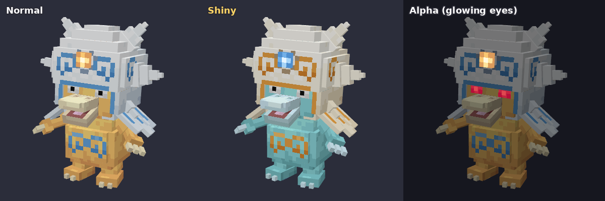
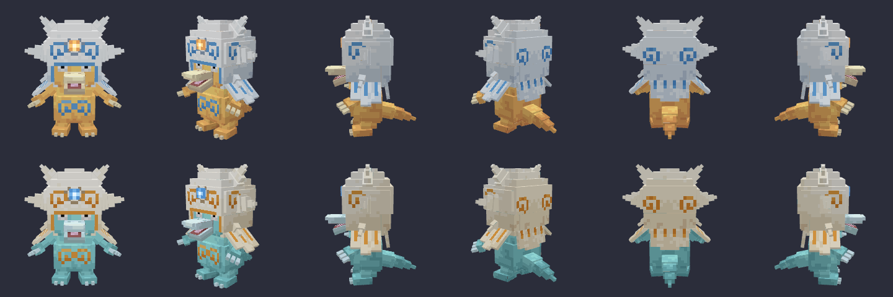
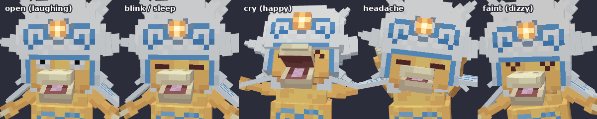
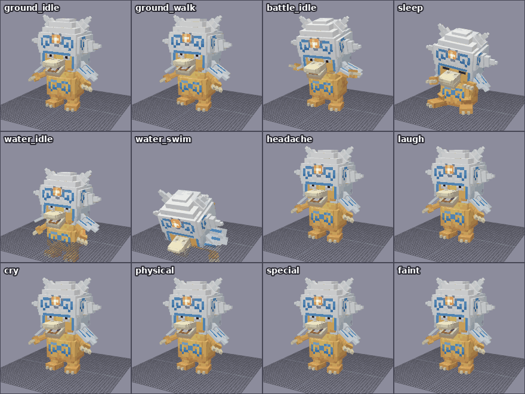

# 스월덕 `swirlduck` (가칭) — 고라파덕의 또 다른 진화, Cobblemon Blockbench 모델

원화에서 골덕 옆에 있는 고라파덕의 새 진화형입니다. 이름이 정해지지 않아 소용돌이(swirl)에서 따 `swirlduck` / 스월덕으로 임시로 붙였습니다. 원하는 이름으로 바꾸는 방법은 아래에 있습니다.

아기고라파덕의 알껍데기가 자라 투구가 된 모습으로 만들었습니다.
- 파란 소용돌이 무늬와 가운데 금색 보석이 있는 커다란 흰 껍데기 투구
- 투구 양쪽에 가시가 3개씩 (위, 옆, 아래)
- 어깨를 덮는 흰색·파란색 깃털 망토
- 배의 파란 소용돌이 두 개
- 고라파덕 특유의 멍한 눈(동공이 위로 올라감)과 크게 벌리고 웃는 부리
- 세 손가락 손, 길고 뾰족한 꼬리





## 텍스처 (고라파덕 텍스처 기반)

몸, 부리, 입 안, 눈, 손발톱 색은 Cobblemon 공식 고라파덕 텍스처(`0054_psyduck/psyduck.png`, `psyduck_shiny.png`)에서 그대로 뽑은 색입니다. 고라파덕과 같은 5단계 색과 얼룩덜룩한 질감으로 칠했습니다. 투구, 소용돌이, 망토, 보석은 새로 정한 색입니다.

| 텍스처 | 파일 | 내용 |
|---|---|---|
| 기본 | `swirlduck.png` | 고라파덕 노란 몸 + 크림색 부리·손발톱, 흰 투구와 망토에 파란 소용돌이·줄무늬, 금색 보석 |
| 이로치 | `swirlduck_shiny.png` | 이로치 고라파덕의 하늘색 몸과 부리. 아기고라파덕 이로치처럼 투구는 크림색이 되고, 파랑과 금색이 서로 바뀝니다 (금색 소용돌이, 파란 보석) |
| 발광 | `swirlduck_emissive.png`, `swirlduck_emissive_shiny.png` | 이마의 보석이 어두운 곳에서도 빛납니다 (공식 불켜미와 같은 `emissive` 레이어) |
| 알파 | `swirlduck_alpha.png` | 알파 포켓몬의 빨갛게 빛나는 눈 (`alpha_eyes` 레이어) |

크기는 128×128이고 Box UV입니다. 좌우 대칭 부위(팔, 다리, 가시, 망토 깃털, 투구 옆면)는 Blockbench의 mirror UV로 텍스처를 같이 씁니다.

## 모델

- 큐브 84개, 본 50개 (로케이터 포함), Bedrock Entity 형식, Box UV
- 본 구조: `swirlduck`(루트) → `body`
  - `torso` → `head`(`shell` 투구 → `gem`, `spike_*`), `cape`(`capelet_*`, `cape_back`), `arm_*` → `forearm_*` → `hand_*`, `tail` → `tail2` → `tail3`
  - `body` → `leg_*` → `foot_*`
- `shell`: 투구. 층층이 쌓은 둥근 머리 부분, 얼굴 양옆과 뒤를 감싸는 벽, 얼굴 둘레의 파란 테두리로 되어 있습니다. 가시는 `spike_top_*`, `spike_side_*`, `spike_low_*` 본마다 끝으로 갈수록 가늘어지는 상자로 만들었습니다
- `gem`: 금색 보석. 배틀 대기 때 맥박처럼 커졌다 작아지고, 특수 공격 때 크게 부풉니다
- `beak` / `jaw`: 부리와 아래턱. 아래턱은 기본으로 20° 벌어져 원화처럼 웃는 얼굴이고, 애니메이션에서 닫히거나 더 벌어집니다
- `pupil_right` / `pupil_left`: 따로 움직이는 동공 (평소에는 위로 올라간 멍한 눈, 두리번거림, 배틀 때는 정면을 봄)
- 표정 판: `eyes_closed`(감은 눈), `eyes_happy`(웃는 눈 ^), `eyes_dizzy`(기절한 눈). 얼굴 표면 안쪽에 숨어 있다가 z 방향으로 -0.5 밀면 나타납니다
- 로케이터: `root`, `top`, `middle`, `target`, `head`, `item_hat`, `face`, `item_face`, `mouth`, `eye_right`, `eye_left`, `special`(보석), `hand_primary`, `physical`, `hand_secondary`, `item`, `tail`



## 애니메이션 14종



| 이름 (`animation.swirlduck.*`) | 내용 |
|---|---|
| `ground_idle` | 숨쉬기, 멍하게 고개를 흔들고 동공이 두리번거림, 웃는 부리가 까딱, 망토 깃털과 팔·꼬리가 흔들림, 보석이 은은하게 맥동 |
| `ground_walk` | 안짱다리로 쿵쿵 걷기. 팔과 망토가 흔들리고 꼬리가 좌우로 휘어짐 |
| `water_idle` | 투구와 얼굴만 물 위로 내놓고 떠서 팔다리로 물장구 |
| `water_swim` | 몸을 앞으로 눕혀 발차기와 팔 젓기로 헤엄 |
| `battle_idle` | 다리를 벌리고 두 손을 들어 대기. 동공이 정면을 보고 망토가 펼쳐지며 보석이 맥동 |
| `sleep` | 꼬리를 깔고 주저앉아 투구 쓴 머리를 꾸벅, 눈과 부리를 닫음 |
| `blink` | 눈 깜빡임 (퀴크) |
| `headache` | 고라파덕의 두통 포즈: 두 손으로 투구 양옆을 붙잡고 눈을 질끈 감은 채 좌우로 흔들림 (퀴크) |
| `laugh` | 원화의 웃는 얼굴: 눈을 웃는 모양으로 감고 부리를 딱딱거리며 들썩들썩 웃기 (퀴크) |
| `cry` | 투구를 젖히고 부리를 크게 벌리며 팔과 망토를 펼침. 울음소리는 `pokemon.golduck.cry` |
| `physical` | 뒤로 움츠렸다가 가시 투구로 들이받기 |
| `special` | 투구를 붙잡고 떠오르며 떨다가 보석이 크게 빛나고, 두 손을 앞으로 뻗어 염력 발사 |
| `recoil` | 맞고 뒤로 밀리며 눈을 감고 팔을 허우적 |
| `faint` | 기절한 눈으로 비틀거리다 무거운 투구 때문에 뒤로 벌러덩 (3초, 공식 기절 애니메이션과 같은 길이) |

포저(`posers/swirlduck/swirlduck.json`)의 포즈는 배틀 대기, 대기, 걷기, 물 위(`FLOAT`), 수영(`SWIM`), 수면입니다. 대기 중에는 깜빡임과, 20~45초마다 두통 또는 웃기 퀴크가 나옵니다. 고개는 `q.look('head')` 로 플레이어를 바라봅니다. 몸집이 커서 어깨 탑승 포즈는 넣지 않았습니다.

## 파일

```
blockbench/swirlduck.bbmodel                                       ← Blockbench 원본 (텍스처 5장·애니메이션 14종 내장)
assets/cobblemon/bedrock/pokemon/models/swirlduck/swirlduck.geo.json
assets/cobblemon/bedrock/pokemon/animations/swirlduck/swirlduck.animation.json
assets/cobblemon/bedrock/pokemon/posers/swirlduck/swirlduck.json
assets/cobblemon/bedrock/pokemon/resolvers/swirlduck/0_swirlduck_base.json
assets/cobblemon/textures/pokemon/swirlduck/swirlduck.png, _shiny, _emissive, _emissive_shiny, _alpha
tools/modelgen/pokemon/swirlduck/                                  ← model.js(형태·색), anims.js(애니메이션), cobblemon.js(포저·리졸버)
```

## 게임에 넣기 (Cobblemon 1.8.1 / Minecraft 1.21.1)

1. 아기고라파덕과 같은 리소스팩입니다. `pack.mcmeta` 와 `assets/` 폴더를 zip 하나로 묶어 `.minecraft/resourcepacks` 에 넣고 켭니다.
2. 이번 작업은 **모델링(클라이언트 파일)만** 포함합니다. 게임에 나오려면 종족 데이터가 따로 있어야 합니다.
   - 종족 id는 `swirlduck` 이어야 합니다 (리졸버가 `cobblemon:swirlduck` 에 연결됨).
   - 고라파덕에서 진화하게 하려면 고라파덕 쪽에 진화를 추가하는 데이터(species_additions)도 필요합니다.
   - 추천 크기: `baseScale` 0.85 (약 2블록 높이, 골덕과 비슷), `hitbox` 너비 0.9 · 높이 1.8 정도.
3. 종족을 추가한 뒤 `/pokespawn swirlduck`, `/pokespawn swirlduck shiny` 로 확인합니다.

## 이름 바꾸기

`tools/modelgen/pokemon/swirlduck/` 의 `model.js` 와 `cobblemon.js` 에 있는 `ID`(와 `FOLDER`) 값을 원하는 id로 바꾸고, `pokemon/swirlduck` 폴더 이름도 같은 id로 바꾼 뒤 `npm run export` 를 실행하면 됩니다. 파일 이름, 본 이름, 애니메이션 이름(`animation.<id>.*`), 리졸버·포저가 전부 새 id로 다시 만들어집니다. 그다음 `assets/` 와 `blockbench/` 에 남은 예전 `swirlduck` 파일을 지우세요.

## Blockbench에서 수정하기

- `blockbench/swirlduck.bbmodel` 을 Blockbench로 엽니다 (Bedrock Entity, Box UV).
- 내보내기는 아기고라파덕과 같습니다: Bedrock Geometry → `models/swirlduck/`, 모든 애니메이션 저장 → `animations/swirlduck/`, 텍스처 → `textures/pokemon/swirlduck/`.
- 게임 UI에서 초상화나 요약 화면 크기가 어색하면 포저의 `portraitScale/portraitTranslation`, `profileScale/profileTranslation` 값을 조정합니다.

## 검증한 것

- **내보내기 일치**: 내보낸 `.geo.json` + `.animation.json` 을 다시 읽어 렌더링한 결과가 `.bbmodel` 과 14개 포즈에서 픽셀 단위로 같습니다 (`npm run verify`). 미러 UV 부위도 포함입니다.
- **바닥 접촉**: 모든 애니메이션의 가장 낮은 점을 시간별로 확인했습니다 (`npm run check`). 걷기와 배틀 대기는 발이 바닥에 붙어 있습니다. 기절할 때 넘어지는 동안에는 각도마다 필요한 높이를 재서, 투구와 꼬리가 땅에 박히지 않게 맞췄습니다. 오차는 0.2 이내이고, 의도한 점프·튕김·공중부양과 물속 동작은 제외입니다.
- **Cobblemon 형식**: 발광 레이어는 공식 불켜미 리졸버, 포저는 공식 피츄 포저, 기절 애니메이션 길이(3초, loop 없음)는 공식 파일과 대조했습니다. 울음소리 `pokemon.golduck.cry` 는 Cobblemon 1.8.1의 `sounds.json` 에 있는 이름입니다.
- **초상화·프로필 위치**: 아기고라파덕과 같은 방법으로 투구와 얼굴이 파티 슬롯에 들어오도록 맞췄습니다.

## 확인하지 못한 것

- 실제 마인크래프트 클라이언트에서는 테스트하지 못했습니다. 미리보기는 Blockbench와 같은 방식으로 그리는 자체 3D 뷰어로 렌더링한 것입니다.
- 종족 데이터가 없어서 게임 속 실제 크기와 히트박스는 종족을 추가한 뒤 확인이 필요합니다.

## 출처

몸·부리·입·눈 색 팔레트는 Cobblemon 팀의 고라파덕 텍스처(Cobblemon 에셋, CC BY-NC 3.0)에서 가져왔습니다. 모델 형태, 텍스처 그림, 애니메이션은 새로 만든 것입니다.
